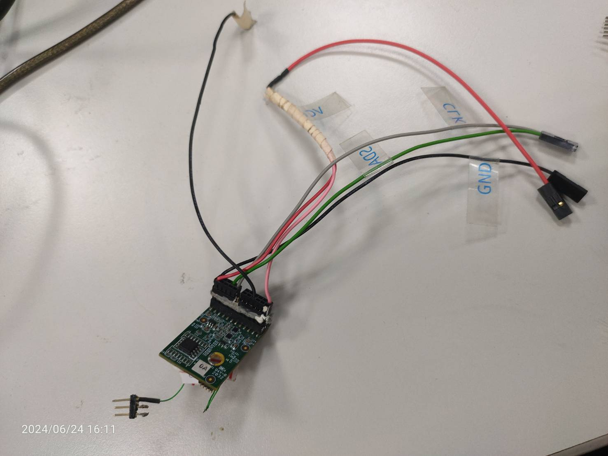
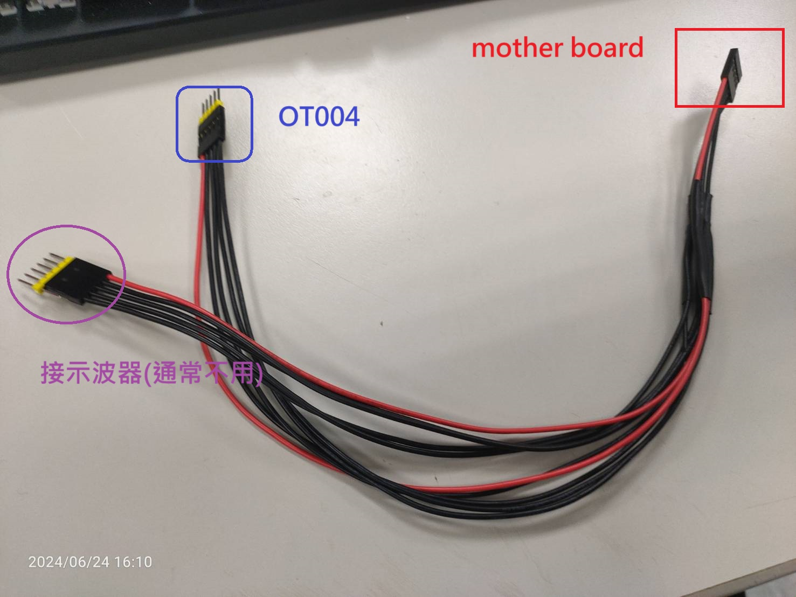
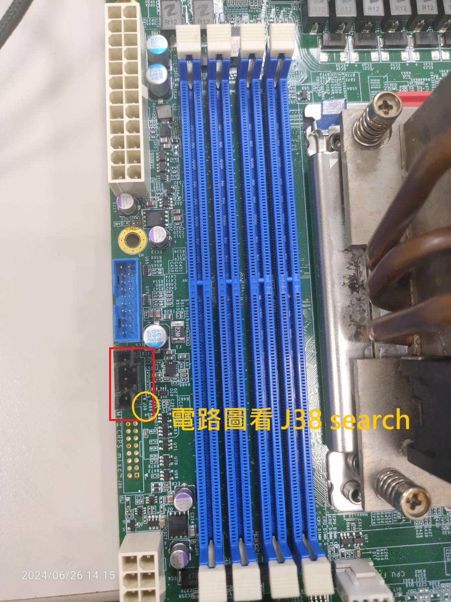
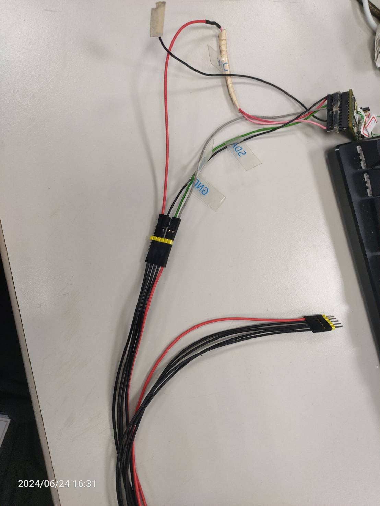

-------------------------------------------------------------------------------

created	:	Mon Jun 24 13:40:30 CST 2024
date	:	Wed Jun 26 14:46:37 CST 2024
[[bmc]]
[[OT004]]

-------------------------------------------------------------------------------
# I2C bus recovery #
這個原理是我們要測試
當BMC發現訊號被 blocked 太久後
(device 拉住SDA的時候)
BMC是不是有I2C bus recovery 的功能
可以reset

SMbus **可能**幾萬次後 有機率發生
訊號被  blocked 住 ( 通常是 32ms )

> SMbus 可能會發生device 被LOW住(我們都會稱為拉住)

> BMC basic : BMC normal status --> high (這樣device 才能溝通)

也因為這樣 所以 stroke 大大他們設計了一個設備 (**OT004**)
*搞破壞*的設備 (不管你BMC 是不是有在溝通 他都會把device 拉住)
當BMC看到你的訊號被blocked住32ms後
BMC 會釋放 **reset 波形的信號**
當 OT004看到這個信號(波形) 就會做出對應的行為 釋放掉他 **等於reset**

# how to do #

## equipment ##
1. ATX :  big power (我們通常有兩種 power)
2. 有一個線是 杜邦線 的接線 (brian's alburt dupont lines)
3. OT004   破壞設備

> PSU 只有一個 I2C (interface) 通常都會接BMC上的 I2C0

> BMC 上會有很多的I2C (依照 chip)

#### brian's al dupont lines  ####

至於接法 要看電路圖
我依照 6102的例子來寫

在插在mother board的地方
看到這個 地方 接上 電路圖
搜尋 J38 就會知道哪裡接 SDA OR LCK

SDA CLK GND VCC

這裡我是依照 brian's al dupont lines 的紅色來看(反正不是CLK 就是 SDA)

# result #
-------------------------------------------------------------------------------
在 OT004 中 你會看到 LED 指示燈
[OT004 detail](https://hackmd.io/@Josh-cpld/rk804uz2F)

## OT004 ##
有三種行為
+ 閃爍綠燈 --(nowork)
+ 恆亮橘燈 --(keep low)
+ 閃爍橘燈 --(done)

都接好後 把BMC 打開

當一開始 OT004 --> 閃爍綠燈

然後OT004 會拉住 I2C --> 恆亮橘燈

I2C recovery function success --> 閃爍橘燈

我測試 很快 所以都會直接到 閃爍橘燈
