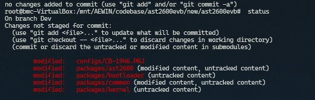

-------------------------------------------------------------------------------
created	:	Mon Oct  7 15:02:52 CST 2024
date	:	.

-------------------------------------------------------------------------------

#  MDS_tool #
筆者的架構分為2種
1. buildsrc -> 用 spx_link
2. convert	->	用 完全分離的 (用這個方式 到時候 還要去你建立的 Devlopment 裡面做 git init)

先說 筆者這裡用的是 `spx-package-links`的方式
~~如果未來會慢慢補齊另外一種方式~~

開啟後 我們通常可以build code 一次
(但是筆者 在這裡 第一次build 的時候 花了 4小時= =)
後來 實在 無法 所以就重新裝一次 VM==

用MDS_TOOL 我的共識 就是 我要改sensor

就會知道 他又給我多很多 奇怪的東西

> malo 會把東西直接退回去
>> 裡面改的東西有些 是版本號
>> 有些是多了 一個 很白癡的folder

