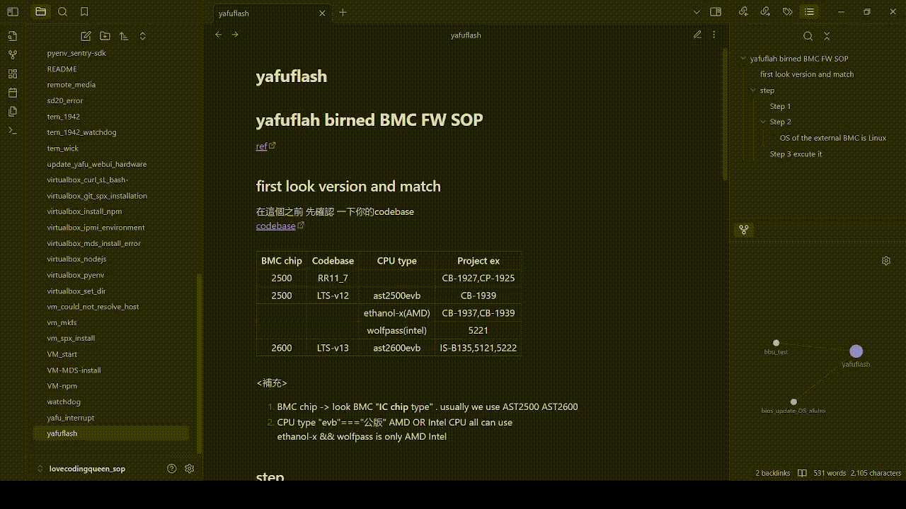

----
created : (歷史 我忘記我甚麼時候建立的...但是遇到 gitlab commpany的問題 就很開心地去找問題 .... 不可考)
date	:	Fri Aug  2 16:52:38 CST 2024

-------------------------------------------------------------------------------

# introduce #
這是程式女王的小小筆記
如果喜歡 請案讚 分享

- 如果有問題 請給我發個訊息

# my_flow #
通常筆者都是用OBS 來開啟
如果你想看所有的部分

## interface introduce  ##

```bash			================start================
####  if ur network slow can look it fast
#### ┌──────┐   ┌─────────┐   ┌────────────┐
#### │      │   │ article │   │ the order  │
#### │ all  │   │ read    │   │ of         │
#### │ file │   │ area    │   │ visualized │
#### │      │   │         │   │ titles     │
#### │      │   │         │   └────────────┘
#### │      │   │         │   ┌────────────┐
#### │      │   │         │   │ related    │
#### │      │   │         │   │ files      │
#### └──────┘   └─────────┘   └────────────┘
```

## Focus mods ##
Simple, intuitive, and convenient folding of a paragraph


##  related file  ##
This is a related concept that can be thought of as a database.
Simply put, it allows you to quickly find the corresponding files


###  example ###


就像這影片 程式女王 可以看這篇文章
+ 右上:
有清晰的標題 點選就跳轉
+ 右下:
可以直接看到相關的文件

~~這是 Wed Oct  9 09:32:45 CST 2024~~
~~也是我在 +172800 seconds 就一年得筆記數量~~
~~再來會越來越多但是我還是喜歡這樣的方式~~

# role #
這裡都是從 各路大神的教導

+ John Chen
  + 其陽神話
  + 超級BMC大神
  + 主管大大
  + 帥帥的 人很好 但是很怕麻煩
  + 香香的
+ Brian Song 宋恩碩
  + 幹話王
  + 蟲王
  + EE涂的掌上明珠
  + 很機車 很好笑 BMC 大神
  + 黑 嘲諷又好笑
+ malo chou 通
  + 掃描眼
  + bmc 大神
  + 藝術天分超高
  + 畫畫超好
  + 很機車...每次都會被笑死+氣死
  + 好人

+ jeffrey
  + tomasen lover
  + 超壯
  + 硬體王
  + 新竹巴拿馬天菜乾隆天子南非女婿
