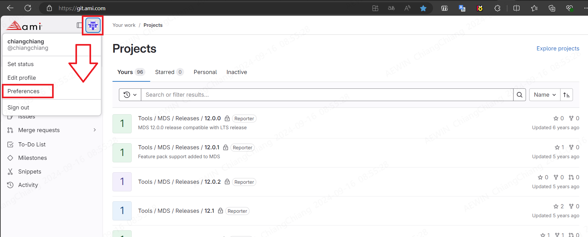
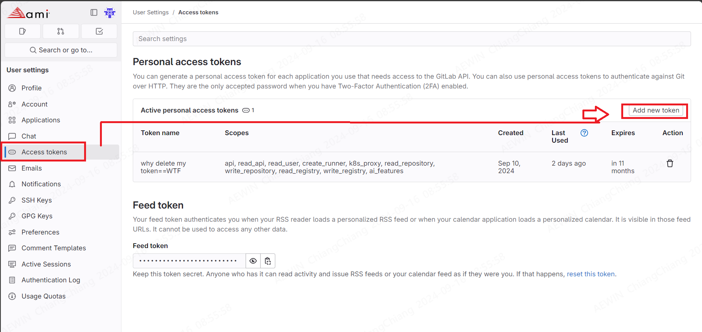
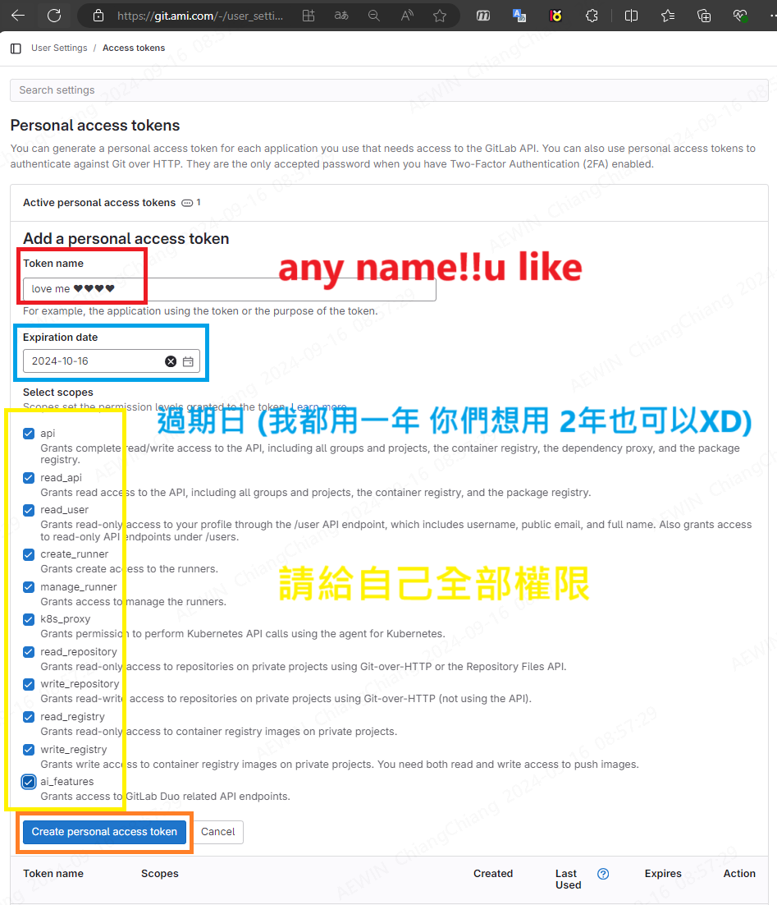
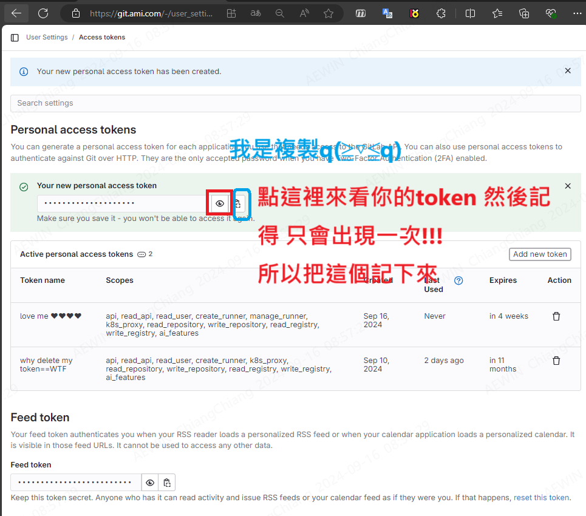
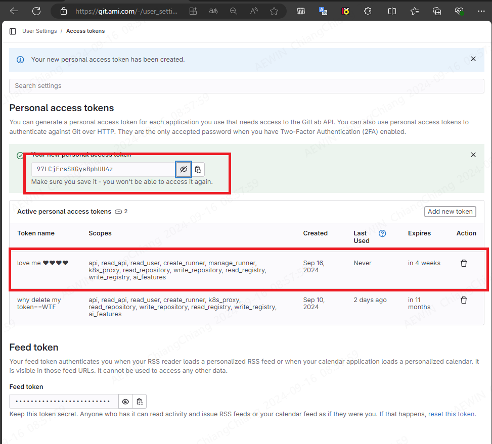

-------------------------------------------------------------------------------
created	:	Mon Sep 16 08:43:58 CST 2024

   date	:	Mon Sep 16 09:14:46 CST 2024

[[token]] [[git]] [[bashrc]]

-------------------------------------------------------------------------------
#  ami token #
[ref](http://sd20-server.aewin.com:3000/pncIlBpCQrGJpcJxyQ-MAQ?view#AMI-Git-Token)

這裡是可以單獨作業
也是一定要做

這就是 github的概念

那這裡要先大概的輪廓給你們知道

在 ami 的地方 會需要兩個帳號
> 更精確的說法是一個帳號有兩個網域
+ [ami-US](https://git.ami.com/)
(https://git.ami.com/)
+ [ami-TW](https://git.ami.com.tw/)
(https://git.ami.com.tw/)

等你建立好後帳號

> 因為 AMI git的政策，開啟2FA後已經無法使用帳號+密碼登入。必須要使用 帳號+token

所以我們就只能設立 **token**

## build token ##



> 這裡很重要 他只會出現這一次 以後就不會出現了!!! (0x0101)




> token 只會出現在你一開始建立的時候
> 得到後就把那串存起來
> 不然未來就看不到了喔
>> 請看 (0x0101)

##  put token in bashrc ##
再來就是把這個token put bash的 環境變數
`gedit ~/.bashrc`
```bash				================start================
## name
export git_user=<git_user_name>
#### 這是我們自己的 gitlab
export ae_git_token=<ae_git_token>
#### git.ami.com 的token (這裡是 上面的例子 )
export ami_us_git_token="97LCjErsSKGysBphUU4z"
#### TW!!!!
export ami_tw_git_token=<ami_tw_git_token>
```
