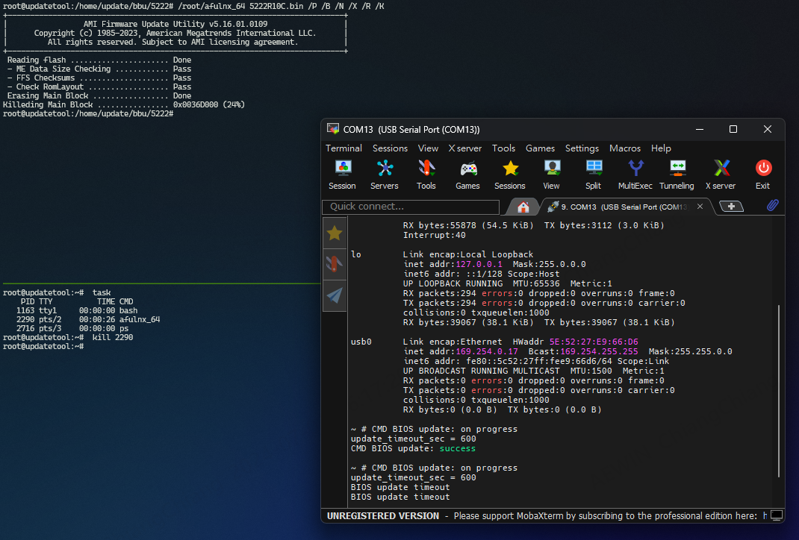

-------------------------------------------------------------------------------
created	:	Fri Jun 28 14:17:47 CST 2024

date	:	Wed Jul  3 16:47:41 CST 2024
[[afulnx]] [[bios]] [[os]] [[error]] [[log]]

-------------------------------------------------------------------------------
#  afulnx_update #
這裡是要說明 我用 工具 `afulnx`

在做 update 的時候

if all success--> bmc console

```bash
###### BMC console
~ # CMD BIOS update: on progress
update_timeout_sec = 600
CMD BIOS update: success
```
```bash
###### OS

root@updatetool:/home/update/bbu/5222#   /root/afulnx_64 5222R10C.bin /P /R /N /X /R /K
+---------------------------------------------------------------------------+
|                 AMI Firmware Update Utility v5.16.01.0109                 |
|      Copyright (c) 1985-2023, American Megatrends International LLC.      |
|         All rights reserved. Subject to AMI licensing agreement.          |
+---------------------------------------------------------------------------+
 Reading flash ...................... Done
 - ME Data Size Checking ............ Pass
 - FFS Checksums .................... Pass
 - Check RomLayout .................. Pass
 Erasing Main Block ................. Done
  Updating Main Block ................ Done
  Verifying Main Block ............... Done
  Erasing Boot Block ................. Done
  Updating Boot Block ................ Done
  Verifying Boot Block ............... Done
  Erasing NVRAM Block ................ Done
  Updating NVRAM Block ............... Done
  Verifying NVRAM Block .............. Done
  Erasing NCB Block .................. Done
  Updating NCB Block ................. Done
  Verifying NCB Block ................ Done


  Process completed.
```
很顯然 最後一段 當然是 bios update success!

如果失敗 的話 那就要等 10 分鐘 就會開始 閃爍 red light


intentional human error
=======================
首先  OS的部分
```bash
root@updatetool:/home/update/bbu/5222#   /root/afulnx_64 5222R10C.bin /P /R /N /X /R /K
+---------------------------------------------------------------------------+
|                 AMI Firmware Update Utility v5.16.01.0109                 |
|      Copyright (c) 1985-2023, American Megatrends International LLC.      |
|         All rights reserved. Subject to AMI licensing agreement.          |
+---------------------------------------------------------------------------+
 Reading flash ...................... Done
 - ME Data Size Checking ............ Pass
 - FFS Checksums .................... Pass
 - Check RomLayout .................. Pass
 Erasing Main Block ................. Done
Updateing Main Block ................ 0x001F9000 (9%)

```

當然要插斷 就需要用 另外一個 session 來完成


```bash
root@updatetool:~#  task
s    PID TTY          TIME CMD
   1163 tty1     00:00:00 bash
   1691 pts/0    00:00:52 afulnx_64
   2148 pts/1    00:00:00 ps
root@updatetool:~#   kill  1691
```

```bash
root@updatetool:/home/update/bbu/5222#   /root/afulnx_64 5222R10C.bin /P /B /N /X /R /K
+---------------------------------------------------------------------------+
|                 AMI Firmware Update Utility v5.16.01.0109                 |
|      Copyright (c) 1985-2023, American Megatrends International LLC.      |
|         All rights reserved. Subject to AMI licensing agreement.          |
+---------------------------------------------------------------------------+
 Reading flash ...................... Done
 - ME Data Size Checking ............ Pass
 - FFS Checksums .................... Pass
 - Check RomLayout .................. Pass
 Erasing Main Block ................. Done
Killeding Main Block ................ 0x001F9000 (9%)

real    1m25.585s
user    0m5.088s
sys     1m8.161s
```

最後才要放 BMC CONSOLE (因為資訊很少)
如果失敗的話
```bash
~ # CMD BIOS update: on progress
update_timeout_sec = 600
BIOS update timeout
BIOS update timeout
```
不過也是從**BMC console** 知道設定time

然後當 `BIOS update timeout`
同時 我測試的5222
硬體有跑出error
+ power blue light bliking
+ reset red light bliking
+ UID oregin light blikning

-------------------------------------------------------------------------------

## solution ##
當然這個軟刷的中斷
可以再使用 `afulnx_64`

-------------------------------------------------------------------------------

# result #
| Barracuda LED event          | Power on LED  | UID LED       | Inform ation LED | Notice            |
|:-----------------------------|:-------------:|:-------------:|:----------------:|:-----------------:|
| BIOS firmware update failed  | always light  | Blinking      | Blinking         | TEST(10min later) |
| ==                           | ==            | ==            | ==               | ==                |
| BIOS firmware update failed  |               | Blinking@10Hz | Blinking@10Hz    | john doc          |
|                              |               |               |                  |                   |
| BIOS firmware update execut  | Blinking0.5Hz | Blinking0.5Hz |                  | TEST              |
| BIOS firmware update success | Light         | Blinking      |                  | TEST              |

## expand - restart ##
when bios failed --> restart --> BIOS is already borken, => it cannot be opened.
```BIOS
#### in BIOS screen
Version : 52222R10C Date: 05/24/2024"
Intel RC Version: 30.P19
 CPU Info : Intel(R) Xeon(R) Silver 4314CPU @ 2.40GHz
    Processors : 2 Cores: 32 Stepping: ICX M1
Memory Info : Memory Size:128GB Memory Speed: 2666MT/s RAS Mode: Indep

-------------------------------------------------------------------------------
System Boot Status

0x31 : Memory Initialization Complete
0xF0 : Recovery -By Firwmare.
0x4F : DEX IPL Start
0xF2 : Recovery Started.
0xF9 : Recovery Capsule Not Found.
0x4F : DEX IPL Start
0xF2 : Recovery Started.
0xF9 : Recovery Capsule Not Found.
```
>  所以只要是flash broken --> 就會對應到相對的行為
