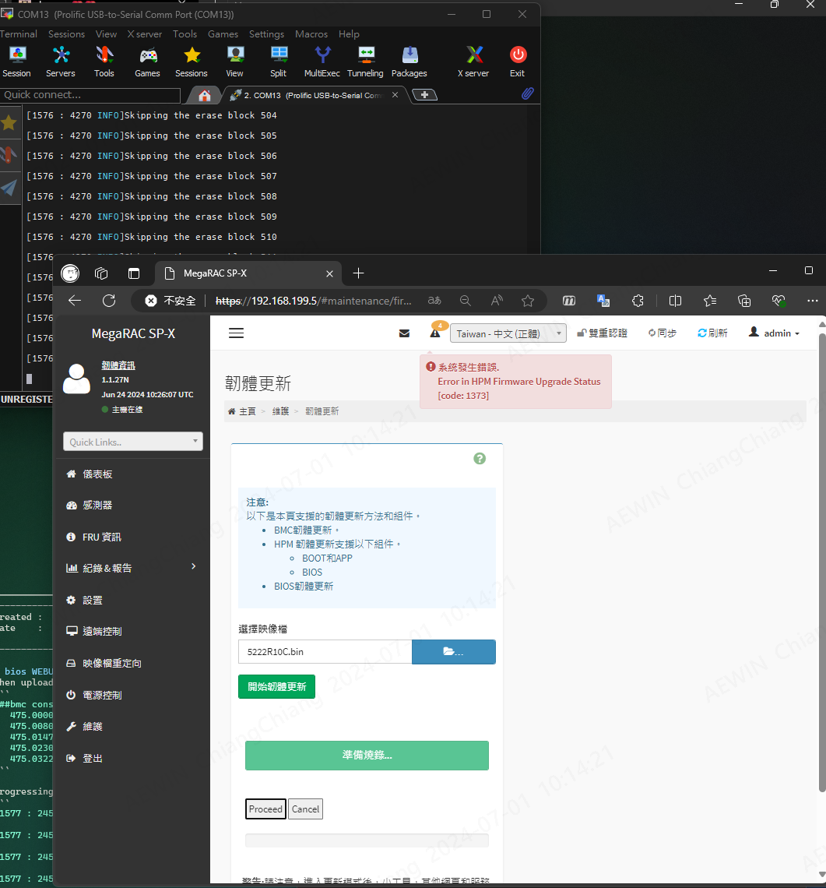
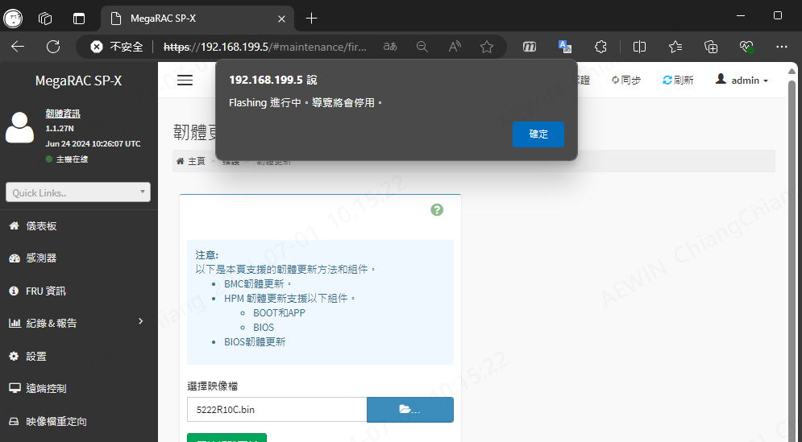

-------------------------------------------------------------------------------
created	:	Mon Jul  1 16:22:28 CST 2024

date	:	Tue Jul  2 16:59:30 CST 2024


-------------------------------------------------------------------------------
#  bios WEBUI process intentional human interrupt  #
如果要看[成功的案例](./bios_webui_update_bmcconsole.md)
當然 我們測試的就是用 WEBUI 在他 process的時後

progressing
```bash
##### bmc console

#### bmc console
[1577 : 2456 INFO]Skipping the erase block 0

[1577 : 2456 INFO]Skipping the erase block 1

[1577 : 2456 INFO]Flashing the erase block 2

[1577 : 2456 INFO]Flashing the erase block 3

[1577 : 2456 INFO]Skipping the erase block 4

[1577 : 2456 INFO]Skipping the erase block 5

[1577 : 2456 INFO]Skipping the erase block 6

[1577 : 2456 INFO]Skipping the erase block 7

[1577 : 2456 INFO]Flashing the erase block 8

[1577 : 2456 INFO]Flashing the erase block 9

[1577 : 2456 INFO]Skipping the erase block 10

[1577 : 2456 INFO]Skipping the erase block 11

[1577 : 2456 INFO]Skipping the erase block 12

[1577 : 2456 INFO]Skipping the erase block 13

[1577 : 2456 INFO]Skipping the erase block 14

[1577 : 2456 INFO]Skipping the erase block 15

[1577 : 2456 INFO]Skipping the erase block 16
...
....
[1577 : 2456 INFO]Skipping the erase block 509

[1577 : 2456 INFO]Skipping the erase block 510

[1577 : 2456 INFO]Skipping the erase block 511

[1577 : 2456 INFO]Bios START update done FlashOffset 0: SizeToWrite 33554432

```
卡在 這裡
我等了 15 分鐘 他還是 卡死的狀態
(硬體燈號 維持著 執行燈號)
但是卻一點動作都沒有

## solution ##
這時候 只有一種解法
就是用 燒入器 直接 重新燒


WEB 直接卡死




# result #
| Barracuda LED Event         | Power on LED | UID LED      | Information LED | Notice |
|:---------------------------:|:------------:|:------------:|:---------------:|:------:|
| bios WEBUI upload interrupt | Bliking@2.z  | Blinking@2Hz |                 | TEST   |
| bios WEBUI proces interrupt | Bliking@2Hz  | Blinking@2Hz |                 | TEST   |
|                             |              |              |                 |        |
| bios WEBUI success          | Light        |              |                 | TEST   |
