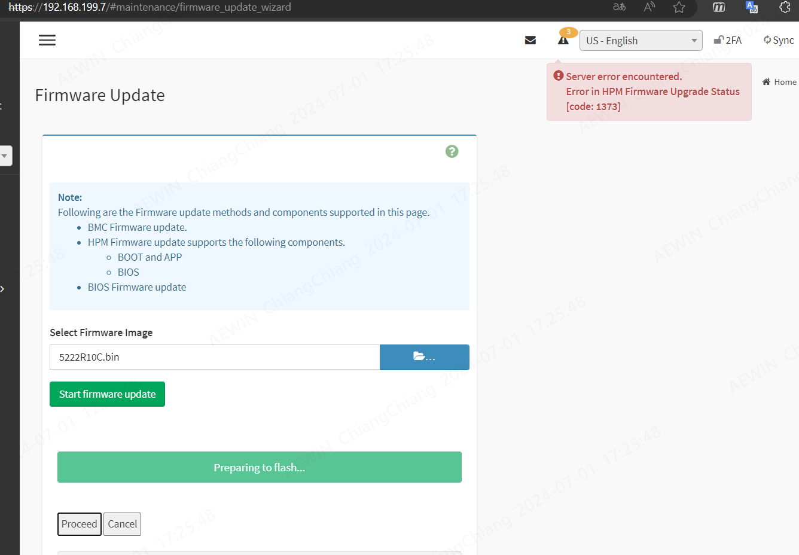
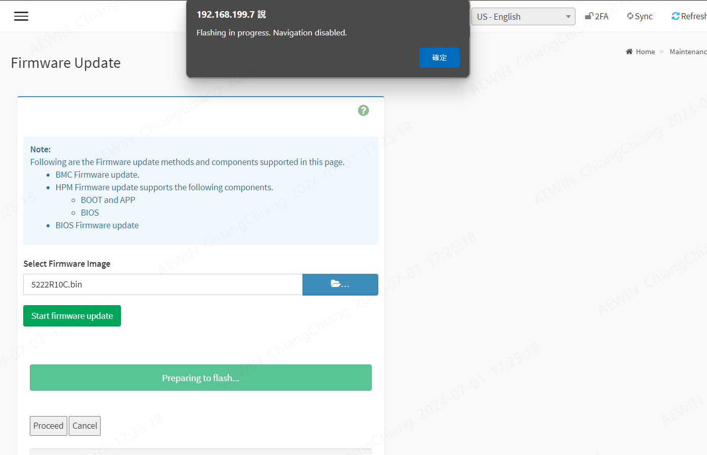

-------------------------------------------------------------------------------
created	:	Mon Jul  1 17:34:49 CST 2024
date	:	.

-------------------------------------------------------------------------------
[成功的案例](./bios_webui_update_bmcconsole.md)
#  bios webui upload interrupt #
```bash
#### bmc console
~ # [  343.559395] aspeed-g6-pinctrl 1e6e2000.syscon:pinctrl: request() failed for pin 12
[  343.567934] aspeed-g6-pinctrl 1e6e2000.syscon:pinctrl: pin-12 (1e780000.gpio:12) status -1
[1593 : 1604 CRITICAL][gpioifc.c:200]set 12 gpio/value 0x0

[  343.585592] aspeed-smc 1e630000.spi: bus_width 2, Using 50 MHz SPI frequency
[  343.593666] aspeed-smc 1e630000.spi: mx25l25635e (32768 Kbytes)
[  343.600281] aspeed-smc 1e630000.spi: CE0 window [ 0x30000000 - 0x32000000 ] 32MB
[  343.608584] aspeed-smc 1e630000.spi: CE1 window [ 0x32000000 - 0x32000000 ] 0MB (disabled)
[  343.617846] aspeed-smc 1e630000.spi: read control register: [203c0441]
```
跟[bios_webui_process_interrupt.md](./bios_webui_process_interrupt.md)
一樣 都是直接 卡死

這時候 在打開一次 WEBUI
會這樣 (已經繞過一些 bug了)

server error encountered.
Error in HPM Firmware Upgrade Status
[code:1373]


Flashing in progress. Navigation disabled.
