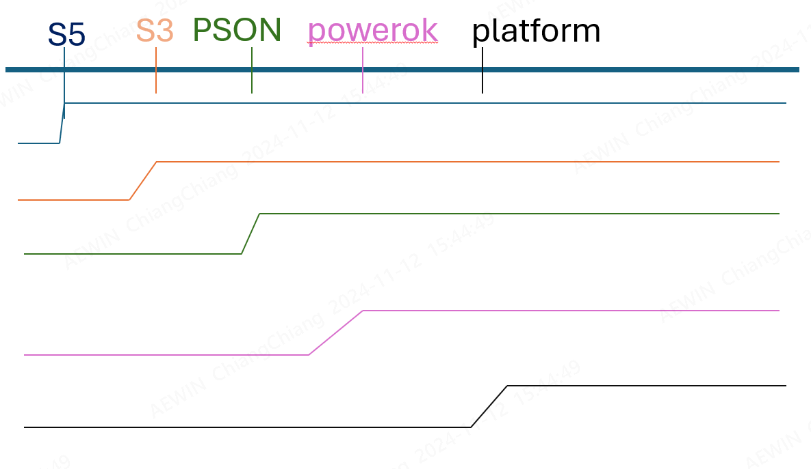

-------------------------------------------------------------------------------
created	:	Tue Nov 12 16:49:59 CST 2024

date	:	.

-------------------------------------------------------------------------------

# bmc-5-core-signal #
BMC 的  5本教
1. S5
2. S3
3. PSON
4. Powerok
5. platform rst

> 雖然BMC 看 `S5` `S3` `powerOK` `platform rst` 就好
> 但是 PSON 就是人類直觀判斷 -> 他後面就是緊接風散
> 所以筆者就把他們暫定為 bmc 5核心重要電訊號

此張圖只是示意圖 不代表都是 low -> high

+ warm-boot :
  + platform rst

+ cold-boot :
  + S3
  + powerOK
  + platform rst

bmc 看 S3
but 人類看 **PSON (以後就是風散轉)**

## cold-warm-boot ##
+ warm-boot :
  + platform rst

+ cold-boot :
  + S3
  + powerOK
  + platform rst
