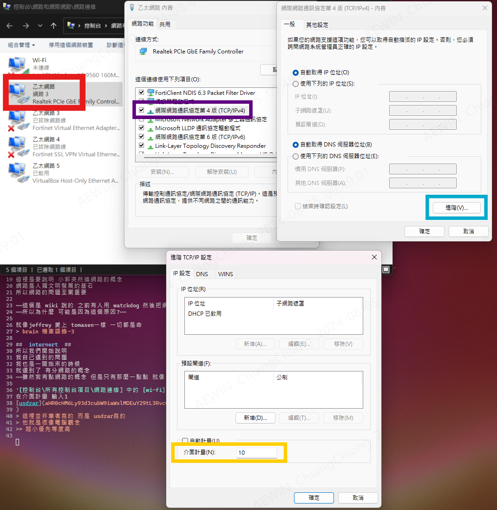

-------------------------------------------------------------------------------
created	:	Mon Aug  5 09:11:15 CST 2024
date	:	.

-------------------------------------------------------------------------------
# metadata #
[[internet]]
[change_internet_a_bit_error](https://home.gamer.com.tw/creationDetail.php?sn=4308110)
[因為這一篇寫得有點問題 所以更正的是]

-------------------------------------------------------------------------------

#  internet_intranet_internet  #

######   have tea   ######

> Here, we need to distinguish between the intranet and the internet. You can only access the NAS using the intranet.

這裡是要說明 小郭突然換網路的概念
網路是人類文明發展的基石
所以網路的問題至關重要

~~這個是 wiki 說的 之前有人用 watckdog 然後把網路用炸裂...~~
~~所以為什麼 可能是因為這個原因?~~

就像jeffrey 愛上 tomasen一樣 一切都是命
> brain 機車語錄-3

##  internert  ##
所以我們開始說明
我自己遇到的問題
我也是一開始來的時候
就遇到了 有分網路的概念
~~雖然我有點網路的概念 但是只有那麼一點點 就像 新竹tomasen jeffrey 電梯事件~~

`[控制台\所有控制台項目\網路連線] 中的 [wi-fi] 按右鍵 > 內容 > 網際網路通訊協定第四版(TCP/ IPv4) > 進階`
在介面計量 輸入1
[usdzar](aHR0cHM6Ly93d3cubW9iaWxlMDEuY29tL3RvcGljZGV0YWlsLnBocD9mPTUwNCZ0PTY1OTMzMTcK
)
> 這裡並非筆者寫的 而是 usdzar寫的
> 他就是很像電腦觀念
>> 越小優先等度高

筆者這裡用的是 乙太10 wifi 1
對我來說 wifi  關掉就可以了
如果要內網(199) 就關掉wifi (120)

199 ->  測試網段
120 ->  可以連到NAS 進入聯合 (相對可以看 我們家的hackmd)
