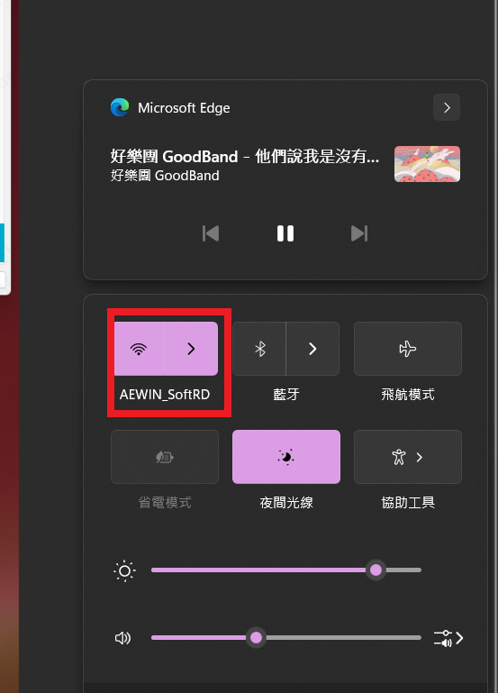

-------------------------------------------------------------------------------
created	:	Mon Aug  5 09:11:15 CST 2024

date	:	Wed Oct  9 09:39:30 CST 2024

[[internet]] [[windows]] [[os]]
[re](https://home.gamer.com.tw/creationDetail.php?sn=4308110)

-------------------------------------------------------------------------------
#  internet_intranet_internet  #

######   have tea   ######

> Here, we need to distinguish between the intranet and the internet. You can only access the NAS using the intranet.

這裡是要說明 小郭突然換網路的概念
網路是人類文明發展的基石
所以網路的問題至關重要

~~這個是 wiki 說的 之前有人用 watckdog 然後把網路用炸裂...~~
~~所以為什麼 可能是因為這個原因?~~

就像jeffrey 愛上 tomasen一樣 一切都是命
> brain 機車語錄-3

##  internert  ##
所以我們開始說明
我自己遇到的問題
我也是一開始來的時候
就遇到了 有分網路的概念
~~雖然我有點網路的概念 但是只有那麼一點點 就像 新竹tomasen jeffrey 電梯事件~~

還有其他事件 就像 120 只給一個設備一個網路
> 如果你OS BMC 要網路 就要兩個

-------------------------------------------------------------------------------
# how to do  #

`[控制台\所有控制台項目\網路連線] 中的 [wi-fi] 按右鍵 > 內容 > 網際網路通訊協定第四版(TCP/ IPv4) > 進階`
在介面計量 輸入1
[usdzar](aHR0cHM6Ly93d3cubW9iaWxlMDEuY29tL3RvcGljZGV0YWlsLnBocD9mPTUwNCZ0PTY1OTMzMTcK
)
> 這裡並非筆者寫的 而是 usdzar寫的
> 他就是很像電腦觀念
>> 越小優先等度高


筆者這裡用的是 **乙太10 wifi 1**
wifi(對我優先度高 關也好關)
對我來說 wifi  關掉就可以了
如果要內網(199) 就關掉wifi (120)

+ 199 ->  測試網段
+ 120 ->  可以連到NAS 進入聯合 (相對可以看 我們家的hackmd)

-------------------------------------------------------------------------------
+ 情境1:

今天你假設你要OS BMC都有網路 你用`192.168.199.xxx`
但是你要看 開案書 OR
帥氣的JOHN說 :"你看一下NAS balabala""

所以就需要用 切到 `192.168.120.xxx`
我之前的方式是用 網路線拔來拔去...
~~現在開啟wifi interface 關掉wifi 就好 ╰(*°▽°*)╯~~


修改 : 筆者現在也不用拔網路線
可以直接 (但是好像要讓你的電腦解析)
我之前是在那邊 兩邊的網域全少
用windows's ping 會快很多
```CMD			================start================
for /L %i in (1,1,254) do ping 192.168.199.%i -n 1 -w 300 > NUL
```
note : 因為 公司 會在22:00 斷網
~~不要問我為什麼會知道~~
~~當你親身經歷後就懂~~
~~什麼程式女王也加班~~
~~還不是virtual box環境再搞🤬🤬~~

但是在windows的網路邏輯裡
> 只要有網路 他就不會找網路

#####  as a side note -- 題外話  #####
如果你跟我一樣 在windows 用類似 暗巷的mode  也可以這樣
for ip in 192.168.199.{1..254};do ping.e $ip -n 1 -w 300;done

最後你在用 網路表看就好
> 當時的我 是因為 再用BMC DEVICE
> 想要把所有的data 抓下來

然後再比對2個東西後 就知道哪一個是BMC IP
但是 我忘記 我的5121 開機要 3m21secounds
當時我2m 就抓了 就錯誤...==
