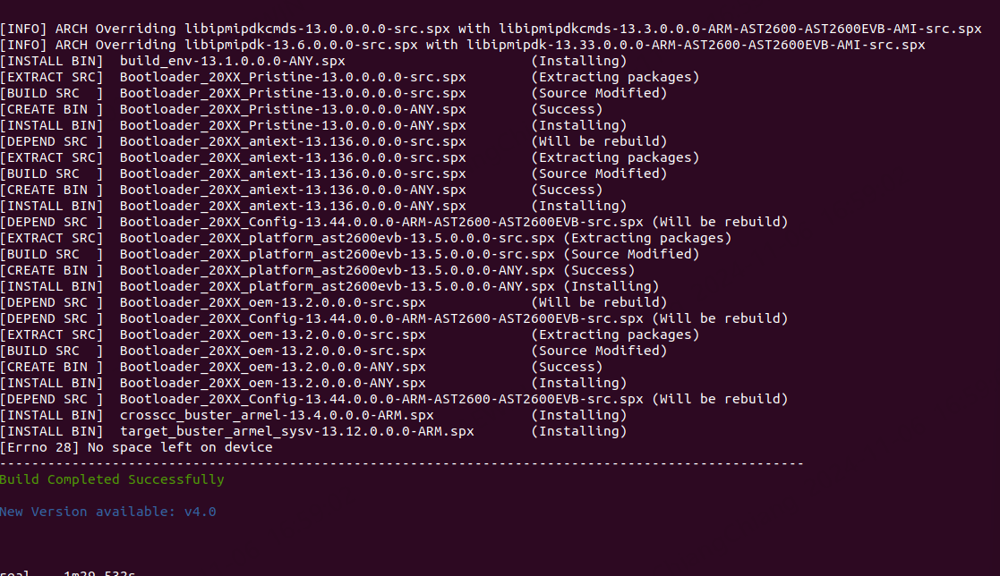

-------------------------------------------------------------------------------
created	:	Mon Oct 14 21:22:07 CST 2024

created	:	Tue Oct 15 17:49:38 CST 2024

date	:	Tue Nov 12 10:46:25 CST 2024

[[project]]
[[1945]]
[[C-enum]]
[[C-uint8_t]]

-------------------------------------------------------------------------------

# 1945-gpu-card #
此專案 是1945 目標
1. 2gpu pluged		-> 1945c	fan table, smart fan
2. 1gpu pluged		-> 1947c 	fan table, smart fan
3. 0gpu pluged		-> 1947a|b	fan table, smart fan(ignore gpu fan table)
4. gpu break		-> fan duty 0xff(full speed)
> gpu break : present pin 0 but temp catch -1°C (my set temperature default : -1 )

[ref-mp4- 00:40:15] `\\192.168.101.240\sd00軟體研發處\SD20SW二部\03_Personal\ChiangChiang\project\1945\1945_gpu_temperature\2024-10-04 Malo_GPU Fan 講解.mkv`

## hardware-GPU-present-pin ##
示波器

+ 波high	-> no device
+ 拉low		-> device

> **present** 是幾乎不會壞的東西
>>  這個是以上電 if(device=0) 就是直接low 到底
>>> --stroke

`ret` => 全部都是 function return
所以 `ret == 0 ` ==>  GPU_present


## cold-boot-warm-boot  ##
####TODO


#### peter-excel-command-spc-not-well ####

`/packages/common/packages/ipmi_dev-src/data/IPMI_AewinPrivateCmd.h`
`AEWINIfcRWReq_T`

`/packages/common/packages/libAEWIN-src/data/Include/AewinPrivateCmd.h`
`./common/packages/libAEWIN-src/data/ipmi_cmd/aewin_cmdselect.c`
`/packages/common/packages/libAEWIN-src/data/ipmi_cmd/aewin_cmdselect.c`
`CMD_AEWIN_BIOS_POST_END`

## mutilpel-define-error ##

-------------------------------------------------------------------------------
-------------------------------------------------------------------------------

# issue #

## no-read-GPIO-pin ##
這裡是重製版 如果想看所有過程
可以[跳至筆者放不重要的地方](#other-no-read-gpio-old)
這裡的過程是
```bash			================start================
┌────────────────────────────────────────────┐   ┌─────────────────────────┐
│ GPIO_U5 reuses this pin                    │   │ GPIO_U5重複使用這pin    │
└────────────────┬───────────────────────────┘   └───────────┬─────────────┘
                 │                                           │
                 V                                           V
┌────────────────────────────────────────────┐   ┌─────────────────────────┐
│ EXCHANGE THE CODE FOR READING 2 GPIO PINS  │   │ 讀取2GPIOPIN的CODE交換  │
└────────────────┬───────────────────────────┘   └───────────┬─────────────┘
                 │                                           │
                 V                                           V
┌────────────────────────────────────────────┐   ┌─────────────────────────┐
│ MOUNTING ISSUES WITH LINUX DEVICE          │   │ LINUX DEVICE 的掛載問題 │
└────────────────────────────────────────────┘   └─────────────────────────┘
```
~~中間那步驟 `exchange the code` 是一種突然的靈感~~

也沒想到這就是發現問題本質的關鍵
> 一種感覺就可以把code 寫好

發現了問題 就離解決他不難了

### solution->no-read-GPIO-pin ###
問題 : 有讀取那個gpio 但是 在linux 下
**萬物皆是檔案**的理念
所以推測實在掛載這些檔案的時候
他還沒掛載成功 -> 所以 code
```C			================start================
static int gpu_count = 0 ;
static int ret = 0;		// check if the code correct execute

do{
    ret = gpio_read_data(GPU_0_PRESENT_PIN, &data);
    gpu_count++;
    //printf("\ngpio_0_present_ret : [ %d ] \n\n",ret);												//lovelovequeen_dev
    sleep(1);
    if(gpu_count > 30 ) break;	// loveempress -- because i test it's need 8 times get  GPU_0_PRESENT_PIN
}while(0 != ret);  //// ret == 0 -> have GPU_present pin ||  ret == 255 -> no GPU
if(0 == data){
    GPU_info[0].present = 0;
}else{
    GPU_info[0].present = 1;
}

data = 1;
gpu_count = 0;

do{
    ret = gpio_read_data(GPU_1_PRESENT_PIN, &data);			// Reading GPU1 is pluged or not
    gpu_count++;
    sleep(1);
    if(gpu_count > 5 ) break;
}while(0 != ret);
if(0 == data){
    GPU_info[1].present = 0;
}else{
    GPU_info[1].present = 1;
}
```
這裡的code 與 [之前的code](#gpu-code-change-0-1-location)

有不同 -> 經過實驗 的確時間是一樣的 幾乎都是 27 28 秒左右


## build-git-spx-no-space ##
```bash			================start================
####================output================>
##  Converting: [Done]
##  Building the source... -src
##  ----------------------------------------------------------------------------------------------------
##  Using Python Version   : 3.8.10
##  Using BuildPRJ Version : 5.8.7
##  [INFO] Updated projdef.h                                          (Entire Tree will be REBUILD)
##  [INFO] Updated projdef.mk                                         (Entire Tree will be REBUILD)
##  Creating Info Contents ...  Done
##  Finding Updated Verions ...
##  WARNING: Fixing Version mimatch for "libipmipdkcmds". Updating [13.0.0.0.0] to [13.3.0.0.0]
##  [INFO] ARCH Overriding libipmipdkcmds-13.0.0.0.0-src.spx with libipmipdkcmds-13.3.0.0.0-ARM-AST2600-AST2600EVB-AMI-src.spx
##  [INFO] ARCH Overriding libipmipdk-13.6.0.0.0-src.spx with libipmipdk-13.33.0.0.0-ARM-AST2600-AST2600EVB-AMI-src.spx
##  [INSTALL BIN]  build_env-13.1.0.0.0-ANY.spx                       (Installing)
##  [EXTRACT SRC]  Bootloader_20XX_Pristine-13.0.0.0.0-src.spx        (Extracting packages)
##  [BUILD SRC  ]  Bootloader_20XX_Pristine-13.0.0.0.0-src.spx        (Source Modified)
##  [CREATE BIN ]  Bootloader_20XX_Pristine-13.0.0.0.0-ANY.spx        (Success)
##  [INSTALL BIN]  Bootloader_20XX_Pristine-13.0.0.0.0-ANY.spx        (Installing)
##  [DEPEND SRC ]  Bootloader_20XX_amiext-13.136.0.0.0-src.spx        (Will be rebuild)
##  [EXTRACT SRC]  Bootloader_20XX_amiext-13.136.0.0.0-src.spx        (Extracting packages)
##  [BUILD SRC  ]  Bootloader_20XX_amiext-13.136.0.0.0-src.spx        (Source Modified)
##  [CREATE BIN ]  Bootloader_20XX_amiext-13.136.0.0.0-ANY.spx        (Success)
##  [INSTALL BIN]  Bootloader_20XX_amiext-13.136.0.0.0-ANY.spx        (Installing)
##  [DEPEND SRC ]  Bootloader_20XX_Config-13.44.0.0.0-ARM-AST2600-AST2600EVB-src.spx (Will be rebuild)
##  [EXTRACT SRC]  Bootloader_20XX_platform_ast2600evb-13.5.0.0.0-src.spx (Extracting packages)
##  [BUILD SRC  ]  Bootloader_20XX_platform_ast2600evb-13.5.0.0.0-src.spx (Source Modified)
##  [CREATE BIN ]  Bootloader_20XX_platform_ast2600evb-13.5.0.0.0-ANY.spx (Success)
##  [INSTALL BIN]  Bootloader_20XX_platform_ast2600evb-13.5.0.0.0-ANY.spx (Installing)
##  [DEPEND SRC ]  Bootloader_20XX_oem-13.2.0.0.0-src.spx             (Will be rebuild)
##  [DEPEND SRC ]  Bootloader_20XX_Config-13.44.0.0.0-ARM-AST2600-AST2600EVB-src.spx (Will be rebuild)
##  [EXTRACT SRC]  Bootloader_20XX_oem-13.2.0.0.0-src.spx             (Extracting packages)
##  [BUILD SRC  ]  Bootloader_20XX_oem-13.2.0.0.0-src.spx             (Source Modified)
##  [CREATE BIN ]  Bootloader_20XX_oem-13.2.0.0.0-ANY.spx             (Success)
##  [INSTALL BIN]  Bootloader_20XX_oem-13.2.0.0.0-ANY.spx             (Installing)
##  [DEPEND SRC ]  Bootloader_20XX_Config-13.44.0.0.0-ARM-AST2600-AST2600EVB-src.spx (Will be rebuild)
##  [INSTALL BIN]  crosscc_buster_armel-13.4.0.0.0-ARM.spx            (Installing)
##  [INSTALL BIN]  target_buster_armel_sysv-13.12.0.0.0-ARM.spx       (Installing)
##  [Errno 28] No space left on device
##  ----------------------------------------------------------------------------------------------------
##  Build Completed Successfully
##  New Version available: v4.0
##  compiler use time : 	1m29.532s
```


## do-while-no-limit-loop-0000 ##
do-while-no-limit-loop
```c			================start================
// do
// {
// 		fan_closeloop_gpu_get_tem = CheckBIOSPostCmplt();
// }while(fan_closeloop_gpu_get_tem < 1);

// if( tem_box_count < 60 )
// 	{
// 		fan_closeloop_gpu_get_tem = CheckBIOSPostCmplt();
//     	printf("\n\n\n==================================[ %d ]=============================\n",tem_box_count); //Dev_test_lovelovequeen
//     	printf("GPU_0_present = %d\n", GPU_info[0].present);
//     	printf("GPU_1_present = %d\n", GPU_info[1].present);
//     	printf("GPU0 temp = [%d] \n GPU1 temp =[%d]\n",gpu_temp_read_data[0], gpu_temp_read_data[1]); //Dev_test_lovelovequeen
//     	/* printf("GPU0 temp = [%x] \n GPU1 temp =[%x]\n",gpu_temp_read_data[0], gpu_temp_read_data[1]); //Dev_test_lovelovequeen */
//     	printf("\n====this is bios return [%d]====\n",fan_closeloop_gpu_get_tem);
// 	}

do
{
    fan_closeloop_gpu_get_tem = CheckBIOSPostCmplt();
    printf("\n\n\n==================================[ %d ]=============================\n",tem_box_count); //Dev_test_lovelovequeen
    printf("GPU_0_present = %d\n", GPU_info[0].present);
    printf("GPU_1_present = %d\n", GPU_info[1].present);
    printf("GPU0 temp = [%d] \n GPU1 temp =[%d]\n",gpu_temp_read_data[0], gpu_temp_read_data[1]); //Dev_test_lovelovequeen

    printf("\n====this is bios return [%d]====\n",fan_closeloop_gpu_get_tem);
    // if( tem_box_count < 4 )  //// lovequeen : origin ( this use number loop )
    // //if( fan_closeloop_gpu_get_tem < 1 )
    // {
    // 	printf("\n\n\n==================================[ %d ]=============================\n",tem_box_count); //Dev_test_lovelovequeen
    // 	printf("GPU_0_present = %d\n", GPU_info[0].present);
    // 	printf("GPU_1_present = %d\n", GPU_info[1].present);
    // 	printf("GPU0 temp = [%d] \n GPU1 temp =[%d]\n",gpu_temp_read_data[0], gpu_temp_read_data[1]); //Dev_test_lovelovequeen
    // 	/* printf("GPU0 temp = [%x] \n GPU1 temp =[%x]\n",gpu_temp_read_data[0], gpu_temp_read_data[1]); //Dev_test_lovelovequeen */
    // 	printf("\n====this is bios return [%d]====\n",fan_closeloop_gpu_get_tem);
    // }
} while ( fan_closeloop_gpu_get_tem < 1 );
```
```bash			================start================
##    ==================================[ 490 ]=============================
##    GPU_0_present = 0
##    GPU_1_present = 1
##    GPU0 temp = [47]
##     GPU1 temp =[-1]
##    ====this is bios return [0]====
##    ===== BIOS_POST = 1 =====
##    ==================================[ 491 ]=============================
##    GPU_0_present = 0
##    GPU_1_present = 1
##    GPU0 temp = [47]
##     GPU1 temp =[-1]
##    ====this is bios return [1]====
##    ===== BIOS_POST = 1 =====
##    ==================================[ 492 ]=============================
##    GPU_0_present = 0
##    GPU_1_present = 1
##    GPU0 temp = [47]
##     GPU1 temp =[-1]
##    ====this is bios return [1]====
##    ===== BIOS_POST = 1 =====
```

### solution->0000 ###

這裡在code 語法裡面 理論要對的
但是出現問題
如果有時間我在找找看問題....
筆者的第一步改法( 超級美 )
```C			================start================
//int fan_closeloop_gpu_get_tem = -1314 ,fan_closeloop_gpu_get_count = 0;
fan_closeloop_gpu_get_count ++;
if(fan_closeloop_gpu_get_count > 9)
{
    fan_closeloop_gpu_get_count = 0;
    if(fan_closeloop_gpu_get_tem != 1)
    {
        fan_closeloop_gpu_get_tem = CheckBIOSPostCmplt();
    }
}
////lovequeen
//// use funcion love_counter ->  infinite loop --lovelovequeen
```


-------------------------------------------------------------------------------

## error-build-git-spx ##

```bash			================start================
Fatal error: Unable to find local grunt.

If you're seeing this message, grunt hasn't been installed locally to
your project. For more information about installing and configuring grunt,
please see the Getting Started guide:

https://gruntjs.com/getting-started
[ERROR]: Failure running build_source in RULES for H5Viewer_html5-13.23.0.0.0-src
----------------------------------------------------------------------------------------------------
Unable to build the tree with the given PRJ and packages directory
```

-------------------------------------------------------------------------------
## issue-compile-no-pthread ##
```gcc			================start================
In file included from /workspace/Build/include/ipmi/IPMI_Main.h:26,
                 from thread.c:11:
thread.c: In function ‘thread_init’:
/workspace/Build/include/ipmi/OSPort.h:364:38: error: expected expression before ‘,’ token
         pthread_mutex_init(&MutexName, &attr);                                     \
                                      ^
thread.c:74:5: note: in expansion of macro ‘OS_THREAD_MUTEX_INIT’
     OS_THREAD_MUTEX_INIT(, PTHREAD_MUTEX_RECURSIVE);
     ^~~~~~~~~~~~~~~~~~~~
make: *** [/workspace/tools/rules/Rules.global:127: thread.o] Error 1
make: *** Waiting for unfinished jobs....
[ERROR]: Failure running build_source in RULES for libAEWIN-1.0.0.0.0-src
----------------------------------------------------------------------------------------------------
Unable to build the tree with the given PRJ and packages directory
```

```bash			================start================
./common/packages/libAEWIN-src/data/device
./common/packages/libAEWIN-src/data/device/psu.c
./common/packages/libAEWIN-src/data/thread.c		//<--- just u !!!!!
./common/packages/libAEWIN-src/data/ipmi_cmd/AewinPrivateCmd.c
```

筆者是用 git 的方式來看有改道甚麼 `status`
後來原來是筆者與john  一起追code的時候不小心改道 然後->儲存
🤣🤣🤣🤣

-------------------------------------------------------------------------------
-------------------------------------------------------------------------------

other
=====
> **這裡就是大雜燴 就是筆者的碎碎唸**
> 不是很重要 所以 等讀者有時間在看

> This isn’t very important, it’s just a supplement.

### c-rule-0-false ###

一開始被這個搞暈
想說 MALO 寫甚麼....
`/packages/common/packages/libAEWIN-src/data/device/fan_closeloop.c`
```C			================start================
    if(!(GPU_info[0].present)){
      printf("================! GPU_info[0].present================\n\n");
    }else{
      printf("if ! else\n\n");
    }
    if(!(GPU_info[1].present)){
        printf("================ GPU_info[1].p================\n\n");
      }else{
      printf("[1] else = =||| \n\n");
    }
```
影片一直可以直接馬....
我可是要去google...
> if(a)		: a 非0 => ture
> if(!a)	: a ==0 => ture
> [ref](https://blog.csdn.net/weixin_44153896/article/details/108217579)
>> 在C語言中，任何非零和非空的值都被視為真[important](https://docs.pingcode.com/ask/304664.html)

以上是基於C的理論 再來需要用 硬體設備的角度來看這個部分
用示波器來看過 - 如果

### array-factory ###
陣列元素

每個陣列元素都是一個結構體，包含兩個欄位：

+ 函數識別碼：一個常數，用於識別特定的 GPIO 函數。
例如，可能有不同的識別碼來表示設置 GPIO 方向為輸入或輸出，讀取 GPIO 資料等操作。

+ 函數名稱：一個字串，表示函數的名稱。
這個名稱通常是對應於函數識別碼的具體操作名稱，例如 “set_gpio_dir_input” 表示設置 GPIO 方向為輸入。

```
FN_MAP GPIO_FN_MAP[] =
{
    {GPIO_FN_W_DIR_IN,    "set_gpio_dir_input"},
    {GPIO_FN_W_DIR_OUT,   "set_gpio_dir_output"},
    {GPIO_FN_R_DIR,       "get_gpio_dir"},
    {GPIO_FN_W_DATA_LOW,  "set_gpio_data_low"},
    {GPIO_FN_W_DATA_HIGH, "set_gpio_data_high"},
    {GPIO_FN_R_DATA,      "get_gpio_data"}
};
```

### struct-array ###
這裡是我覺得很厲害的
目的是:好整理
前人們用很多 我就用我看到的
但是困惑我很久的 (我知道 struct 可能偏不熟)
L : `/packages/common/packages/libAEWIN-src/data/Include/psu.h`
```C			================start================
typedef struct
{
	BOOL Enable;
    uint8_t PSU_number;
    uint8_t sensor_number;
    uint16_t Status_word;
    uint16_t Status_word_pre;
    uint16_t Switch_gpio;
    uint16_t Detect_gpio;
    uint16_t PowerOK_gpio;
}PSU_INFO;
```
L : `packages/common/packages/libAEWIN-src/data/device/psu.c`
```C			================start================
PSU_INFO PSU_Device_Info[MAX_PSU_NUMBER] =
{
    //Enable,     PSU_number,       sensor_number,        pStatus_word,       pStatus_word_pre,     Switch_gpio,         Detect_gpio,     PowerOK_gpio
    //                                                                                              (low active)         (low active)    (high active)
    {ENABLE,            0x01,         PSU0_SENSOR,                   0,                      0,     PSU0_SWITCH,        PSU0_PRSNT_N,      PSU0_PWROK},
    {ENABLE,            0x02,         PSU1_SENSOR,                   0,                      0,     PSU1_SWITCH,        PSU1_PRSNT_N,      PSU1_PWROK},
};
```
他是一個 struct 但是在用一個 array
前人很多都用這樣的形勢!!!
> EE涂的摯愛brian大神

###  bmc_console_c_sh  ###
這是有時候他的顯示很醜....
我才發現 他有太多東西要跑
像這裡...

```bash			================start================
Starting Video Redirection Server :adviserd================gpio_0_PRESENT  [ 7 ]  count================
(255)
```
後面的===是我寫的 ≡(▔﹏▔)≡

但是我查了一下 前面的
```bash			================start================
packages/common/packages/adviser-src/data/adviserd.sh
92:    echo -n "Starting Video Redirection Server :adviserd"
```
這裡跑了 sh c ....etc...

-------------------------------------------------------------------------------
-------------------------------------------------------------------------------
-------------------------------------------------------------------------------

## find-do-while-0000 ##
```C			================start================
if(fan_closeloop_gpu_get_count < 1314520 ){
    do
        {
            fan_closeloop_gpu_get_tem = CheckBIOSPostCmplt();
            printf("\n\n\n==================================[ %d ]=============================\n",fan_closeloop_gpu_get_count); //Dev_test_lovelovequeen
            printf("GPU_0_present = %d\n", GPU_info[0].present);
            printf("GPU_1_present = %d\n", GPU_info[1].present);
            printf("GPU0 temp = [%d] \n GPU1 temp =[%d]\n",gpu_temp_read_data[0], gpu_temp_read_data[1]); //Dev_test_lovelovequeen

            printf("\n====this is bios return [%d]====\n",fan_closeloop_gpu_get_tem);
            // if( tem_box_count < 4 )  //// lovequeen : origin ( this use number loop )
            // //if( fan_closeloop_gpu_get_tem < 1 )
            // {
            // 	printf("\n\n\n==================================[ %d ]=============================\n",tem_box_count); //Dev_test_lovelovequeen
            // 	printf("GPU_0_present = %d\n", GPU_info[0].present);
            // 	printf("GPU_1_present = %d\n", GPU_info[1].present);
            // 	printf("GPU0 temp = [%d] \n GPU1 temp =[%d]\n",gpu_temp_read_data[0], gpu_temp_read_data[1]); //Dev_test_lovelovequeen
            // 	/* printf("GPU0 temp = [%x] \n GPU1 temp =[%x]\n",gpu_temp_read_data[0], gpu_temp_read_data[1]); //Dev_test_lovelovequeen */
            // 	printf("\n====this is bios return [%d]====\n",fan_closeloop_gpu_get_tem);
            // }
        } while ( fan_closeloop_gpu_get_tem < 1 );
    printf("\n\n~~~~~~~~\nthis is break do-while\n~~~~~~~~~~~~~~~~~~~~~~~~~~~~~~~~~~~~~~~~~~~~~~~~~~~~~~~~~~~~~~~~\n\n");
}
```
```bash			================start================
################ this ti output
#### ==================================[ 1 ]=============================
#### GPU_0_present = 0
#### GPU_1_present = 1
#### GPU0 temp = [-1]
####  GPU1 temp =[-1]
#### ====this is bios return [0]====
#### ===== BIOS_POST = 1 =====
####
#### ==================================[ 1 ]=============================
#### GPU_0_present = 0
#### GPU_1_present = 1
#### GPU0 temp = [-1]
####  GPU1 temp =[-1]
####
#### ====this is bios return [1]====
#### ~~~~~~~~
#### this is break do-while
#### ~~~~~~~~~~~~~~~~~~~~~~~~~~~~~~~~~~~~~~~~~~~~~~~~~~~~~~~~~~~~~~~~
#### gpu_info[0] card temp error
#### SetBIOSPostCmplt
#### ===== BIOS_POST = 1 =====
####
#### ==================================[ 2 ]=============================
#### GPU_0_present = 0
#### GPU_1_present = 1
#### GPU0 temp = [40]
####  GPU1 temp =[-1]
####
#### ====this is bios return [1]====
####
#### ~~~~~~~~
#### this is break do-while
#### ~~~~~~~~~~~~~~~~~~~~~~~~~~~~~~~~~~~~~~~~~~~~~~~~~~~~~~~~~~~~~~~~
####
#### ===== BIOS_POST = 1 =====
```
筆者復原不了當時的問題點
但是的問題是 可以看 上上的章節 [DWNLL](#do-while-no-limit-loop-0000)
他的output 是 他已經抓到 `biospostcmplt=1` 但是卻沒有跳出loop

> 能不用 do-while 就不要用
> 因為 我們並不是一定需要取得一個很正確的數值
> 這樣可能會 把全部卡死都有可能		---**其陽神話john**

## other-no-read-gpio-old ##

#### cant-read-GPIO-pin-conflic-by-same-GPIO ####
####TODO--peter

~~Mon Nov  4 14:33:22 CST 2024~~
這裡的問題是
一開始以為會發生是因為peter
也有用到 GPIO_('U',5)
`/packages/common/packages/libAEWIN-src/data/Include/gpio.h`
+ `#define GPU_1_PRESENT_PIN   GPIO_('U', 5)`
+ `#define GPU_0_PRESENT_PIN   GPIO_('U', 3)`
後來發現 其實不是這個問題!!!

後來發現 可能是 **linux device** 的掛載問題
為什麼會發現這個問題 ~~我就是因為這樣 瘋狂加班呢~~
一開始 是我只是到 有兩個 slot (這裡要看 電路圖)
`\\192.168.101.240\sd00軟體研發處\SD20SW二部\03_Personal\ChiangChiang\project\1945\1945_gpu_temperature`
[gpiu3](./pic/1945/p_1945_gpu_gpiu3.png)
####TODO->what the wire to do

#### two-gpio-present-pin-0error-1ok ####

####TODO

#### track-code-same-function-call ####

```C			================start================
        ret = gpio_read_data(GPU_1_PRESENT_PIN, &data);			// Reading GPU1 is pluged or not
```

```C			================start================
//// /packages/common/packages/libAEWIN-src/data/Include/gpio.h
// GPU card present pin         // Malo_Chou 2024-09-30 For GPU card present pin
#define GPU_0_PRESENT_PIN   GPIO_('U', 3)
#define GPU_1_PRESENT_PIN   GPIO_('U', 5)
```

```C			================start================
| 1                                        | 2 | 3 | 4 |
|------------------------------------------|---|---|---|
| gpio_read_data //fan_sloseloop.c         |   |   |   |
| ret=gpio_fn_r_data(&gpio_info) // gpio.c |   |   |   |
| if( NULL != GPIO_FN[GPIO_FN_R_DATA])     |   |   |   |
|
```

#### define-GPIO-0-PRESENT-PIN ####

`/packages/common/packages/libAEWIN-src/data/device/fan_closeloop.c`
```C			================start================
////first find this part
ret = gpio_read_data(GPU_0_PRESENT_PIN, &data);
```

##### tip-vscode #####

筆者用 vscode 直接 `Ctrl-Alt-left` 點及 `GPU_0_PRESENT_PIN`
會自動jump `/packages/common/packages/libAEWIN-src/data/Include/gpio.h`
```C			================start================
// GPU card present pin         // Malo_Chou 2024-09-30 For GPU card present pin
#define GPU_0_PRESENT_PIN   GPIO_('U', 3)
#define GPU_1_PRESENT_PIN   GPIO_('U', 5)
////[ref](2024-10-04 Malo_GPU Fan 講解  -- 10:19)
```
```C			================start================
#define GPIO_(group, number) ((group - 'A') * 8 + number)
////筆者在這裡會遇到問題 筆者會放一個 gpio table (form john)
////####TODO
```

##### tip-mdstool #####

如果是mdstool 就用 `F3`
但是筆者試過 發現vscode
的覆蓋性大於mdstool


#### gpu-present-pin-error ####

這個坑真的太大了....我就娓娓來說明
一開始是以為硬體slot 有問題
*因為當時有GPU CARD*
但是就是認不到
但是當我把 `GPU_0` and `GPU_1`
code snip change 就是前面那段code 認不到

#### gpu-code-change-0-1-location ####

```C			================start================
		GPU_info[0] = gpio_read_data(GPU_0_PRESENT_PIN, &data);
		GPU_info[1] = gpio_read_data(GPU_1_PRESENT_PIN, &data);
        //// Don’t worry, this is the wrong code
```
```C			================start================
    static int gpu_count = 0 ;
    static int ret = 0;		// check if the code correct execute
    //// do while --> 是PE大帝說要用try-catch
    do{
		ret = gpio_read_data(GPU_0_PRESENT_PIN, &data);
		gpu_count++;
		printf("================gpio_0_PRESENT  [ %d ]  count================\n(%d)\n",gpu_count,data); //lovelovequeen_dev
		//printf("\ngpio_0_present_ret : [ %d ] \n\n",ret);												//lovelovequeen_dev
		sleep(3);				//我自己加的時間 --> 但是john 說不好 但是我還是持續用
		if(gpu_count > 15 ) break;	// loveempress -- because i test it's need 8 times get  GPU_0_PRESENT_PIN ####TODO
    }while(0 != ret );
	/* if (0 == data) ? GPU_info[0].present = 1 : GPU_info[0].present = 0; */
    if(0 == data){
        GPU_info[0].present = 0;
    }else{
        GPU_info[0].present = 1;
    }

	data = 1;
    gpu_count = 0;

    do{
        ret = gpio_read_data(GPU_1_PRESENT_PIN, &data);			// Reading GPU1 is pluged or not
        gpu_count++;
        printf("================gpio_1_PRESENT  [ %d ]  count================\n(%d)\n",gpu_count,data); //lovelovequeen_dev
        sleep(3);
        if(gpu_count > 5 ) break;
    }while(0 != ret);
	/* if (0 == data)? GPU_info[1].present = 1 : GPU_info[1].present = 0; */
    if(0 == data){
        GPU_info[1].present = 0;
    }else{
        GPU_info[1].present = 1;
    }
```


#### track-code ####
所以在上面兩個章節
[hardware-GPU-present-pin](#hardware-gpu-present-pin)
[GPU-code-change-location](#gpu-code-change-location)
如果有設備 是可以讀取到
(if have device)
+ `GPU_info[0] -> 0`
+ `GPU_info[1] -> 1`
