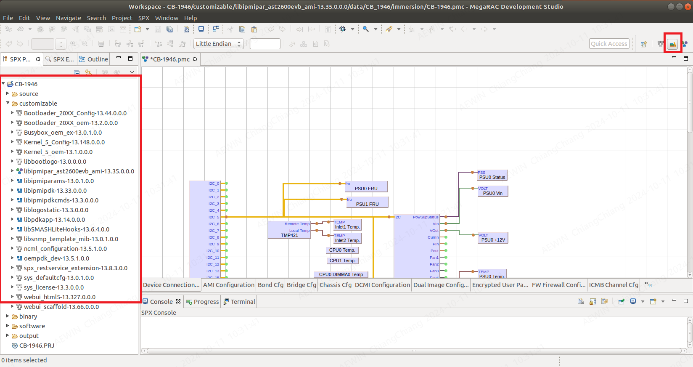
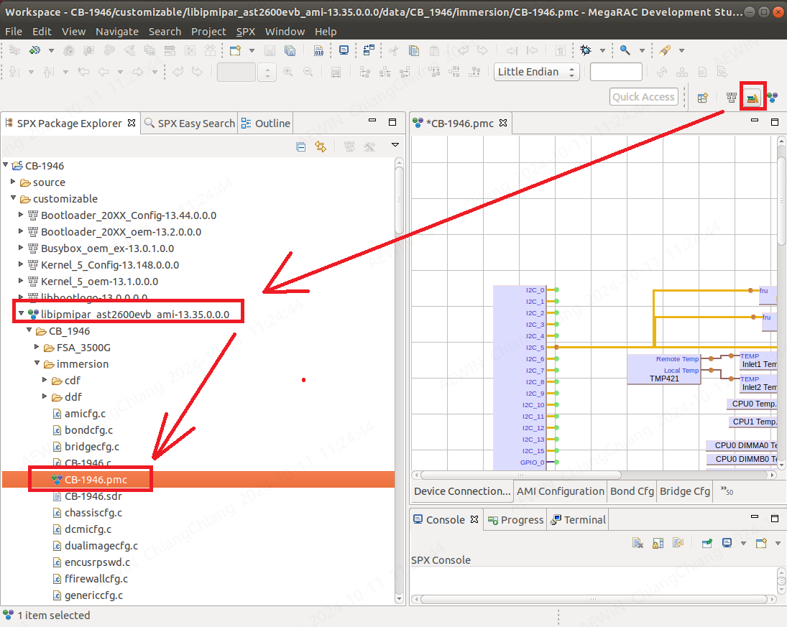
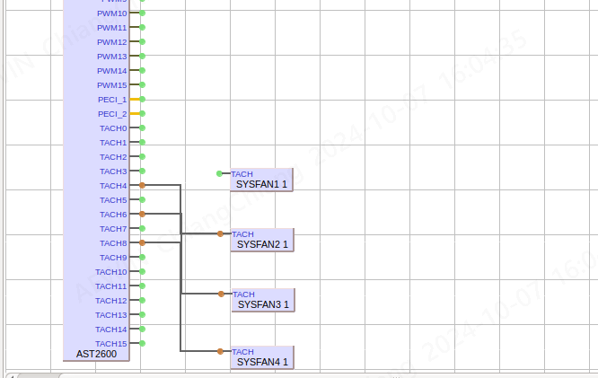
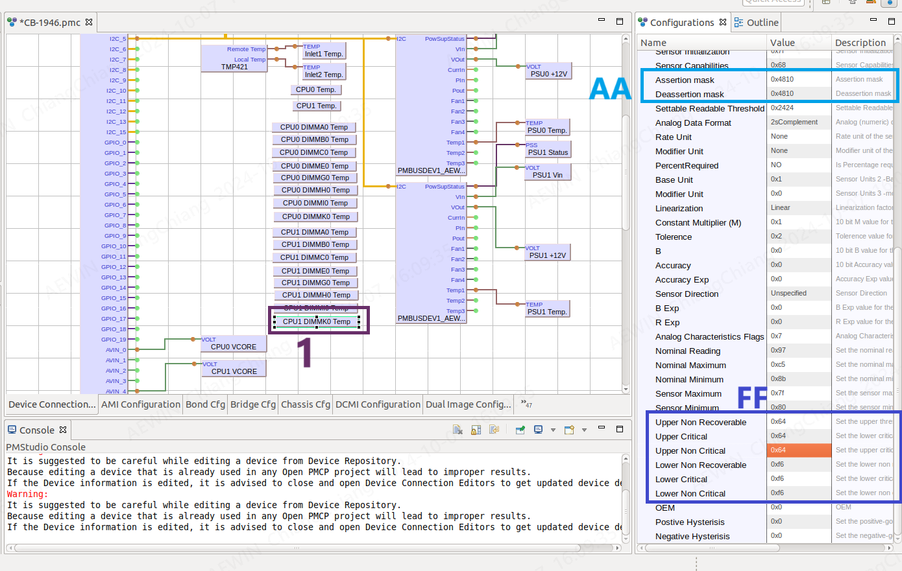

-------------------------------------------------------------------------------
created	:	Tue Oct  8 10:39:07 CST 2024

date	:	.

[[project]]
[[1946]]
[[sensor]]
[[fan]]
[[mds]]
[[sku]]
[[threshold]]

-------------------------------------------------------------------------------

# 1946-feature #

本篇文章是要說明1946 拿掉所有的
1. fan  sensor
2. temperature

1946 -> ast2600evb

-------------------------------------------------------------------------------

# step #
1. create a SKU
2. remove fan sensor
3. temperature

這裡的方式 是用 peter 的用法
先建構一個 SKU
~~###TODO 可能會去看 multiple platforms~~
### add_new_sku ###
EX : like 1 CPU 2 CPU ...etc.

因為 比大帝 當時一開始建構的時候
就有 `SKU_A SKU_B SKU_C SKU_D SKU_E`
但是因為 `SKU_A == SKU_C` 他就沒有建立 `SKU_C`
而我改的方式 一開始使用 `SKU_C`
所以 就開始 先找到 SKU的位置
在 1946 `/packages/libipmipar_ast2600evb_ami-ARM-AST2600-AST2600EVB-AMI-src/data/CB_1946`
```bash			================start================
##  /mnt/AEWIN/codebase/ast2600evb/ast2600evb/packages/l
##ibipmipar_ast2600evb_ami-ARM-AST2600-AST2600EVB-AMI-src/data/CB_1946
##.
##├── FSA_3500G
##├── immersion			<---- this is my immersion folder
##├── STD
##├── STD_1CPU
##├── STD_1CPU_6_FAN
##├── STD_1CPU_6_FAN_ROTOR_2
##├── STD_1CPU_ROTOR_2
##├── STD_6_FAN
##├── STD_6_FAN_ROTOR_2
##└── STD_ROTOR_2
```
以上的方式 筆者用的 immersion 是 copy from `STD`
```C				================start================
// /packages/common/packages/libpdkapp-src/data/PlatformHooks.c
		/* read_buffer[0] = 0xFF;
		   set default -> immersion
		*/
        read_buffer[0] = 0x09;		//default -> set immsersion
		bytes_read = (*i2cwriteread)(i2c_dev, Addr >> 1, write_buffer, read_buffer, 1, 1);
		if( bytes_read < 0 )
		{
			printf("Read EEPROM 0xDB fail...\n");
		}

		dlclose(handle);
		//SD20-brian-Read BMC EEPROM--]

		if(read_buffer[0] == 0xff)
		{
            strcpy(pPlatformId->PlatformName, "STD");
		}
        else if(read_buffer[0] == 0x01)
		{
			strcpy(pPlatformId->PlatformName, "STD_6_FAN");
		}
        // 0x09 is anynumber
        else if(read_buffer[0] == 0x09)
		{
			strcpy(pPlatformId->PlatformName, "immersion");
		}
        else
		{
            strcpy(pPlatformId->PlatformName, "STD");
		}
```
location:`packages/libipmipar_ast2600evb_ami-ARM-AST2600-AST2600EVB-AMI-src/spx/RULES.py`
```python			================start================
""" immersion """
""" /mnt/AEWIN/codebase/ast2600evb/ast2600evb/packages/
libipmipar_ast2600evb_ami-ARM-AST2600-AST2600EVB-AMI-src/spx/RULES.py """
	retval = Py_MkdirClean(TEMPDIR+"/"+PACKAGE+"/tmp/FSA_3500G")
	if retval != 0:
		return retval

	retval = Py_MkdirClean(TEMPDIR+"/"+PACKAGE+"/tmp/immersion")
	if retval != 0:
		return retval

	retval = Py_CopyFile(BUILD+"/"+PACKAGE+"/data/IPMI.conf",TEMPDIR+"/"+PACKAGE+"/tmp")
	if retval != 0:
		return retval

	retval = Py_CopyFile(BUILD+"/"+PACKAGE+"/data/CB_1946/STD_1CPU_6_FAN_ROTOR_2/SDR.dat",TEMPDIR+"/"+PACKAGE+"/tmp/STD_1CPU_6_FAN_ROTOR_2")
	if retval != 0:
		return retval

	retval = Py_CopyFile(BUILD+"/"+PACKAGE+"/data/CB_1946/FSA_3500G/SDR.dat",TEMPDIR+"/"+PACKAGE+"/tmp/FSA_3500G")
	if retval != 0:
		return retval

	retval = Py_CopyFile(BUILD+"/"+PACKAGE+"/data/CB_1946/immersion/SDR.dat",TEMPDIR+"/"+PACKAGE+"/tmp/immersion")
	if retval != 0:
		return retval
```
location: `packages/libipmipar_ast2600evb_ami-ARM-AST2600-AST2600EVB-AMI-src/spx/PACKAGES.D/libipmipar_ast2600_ami/SCRIPTS/dev-install.py`
```python			================start================
""" /mnt/AEWIN/codebase/ast2600evb/ast2600evb/packages/
libipmipar_ast2600evb_ami-ARM-AST2600-AST2600EVB-AMI-src/
spx/PACKAGES.D/libipmipar_ast2600_ami/SCRIPTS/dev-install.py  """

def build_install():
    retval = build_mutiple_platform("immersion")
    if retval != 0:
        return retval
```
以上是我修改的code

因為是修改sensor 所以我們要使用 MDS-TOOL
~~不是說要改sensor就一定要MDStool 是用這個省時省力~~
**以下筆者都會稱 MDS**

開啟後 我們改sensor
位置是 : `/packages/libipmipar_ast2600evb_ami-ARM-AST2600-AST2600EVB-AMI-src/data/CB_1946/immersion`

可以點選這個 就會讓icon 改變



再來 要用SKU (這裡選到特定的folder)下的
`packages/libipmipar_ast2600evb_ami-ARM-AST2600-AST2600EVB-AMI-src/data/CB_1946/immersion/CB-1946.pmc`
> 但是這個路徑和MDS 開啟的不太一樣
>> 請往下看圖片


### remove fan sensor ###
因為是沉靜式 所以 需要 移除所有的fan sensor

> note :
> 1. **line** remove
> 2. **object** remove

### temperature-change-100 ###

此範例用 1946 CPU1 DIMMKK0 Temp 來示範 (記得 Temp <-> Temperature)
+ 1		:	就是物件 sensor
+ AA	:   這裡的assertion mast : 0x4810 **0x4810 表示 只有1個 **
~~這需要去讀書 peter說的~~
SPC 是PE大帝給我的 我copy 放在 `\\192.168.101.240\sd00軟體研發處\SD20SW二部\03_Personal\ChiangChiang\myself\role\SD20-peter\ipmi-second-gen-interface-spec-v2-rev1-1 1.pdf`
+ FF	:	Upper \*
這裡就是更改的數字 				(請用hex來寫)
0x64(hex)->100(dec)

##### sensor-threshold #####
| 1                     | 2              | 3                  |
|:---------------------:|:--------------:|:------------------:|
| Upper Non Recoverable | Upper Critical | Upper Non Critical |
| Lower Non Recoverable | Lower Critical | Lower Non Critical |

如過要確認 就用 `ipmitool sensor`

-------------------------------------------------------------------------------

# as_side_note #
> SKU 筆者理解為 : 對應不同的環境

> SD20 用 不同的SKU 來區分 EX:1CPU 2CPU...etc
> 所以今天我們要切換 SKU 就用
> `ipmitool raw 0x1c 0x01 0x02 0x04 0xac 0x00 0x02 0xbb 0x09`
> 這個下面的篇幅會介紹到

> 但是依照 stroke 的說法:
> 他還是希望用硬體的配置來切換
> 就是當有一根PIN 探則到CPU有上
> 我們BMC就用探測到的訊號來寫

>> 兩種方式各有利弊
|sku |
