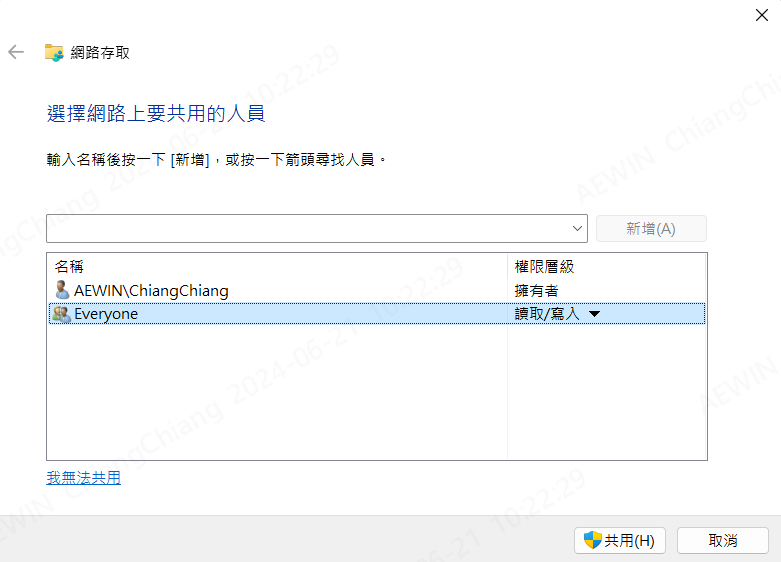

---
created	:	Thu Jun 20 09:10:09 CST 2024
date	:	.

---

# meatadata #
[John\_ref](http://sd20-server.aewin.com:3000/s/HJqGnH6ap)
[brian\_CIFSref](https://hackmd.io/@kZ_Gc4xdSXW-gxf45fbQUQ/HJ72NKw-R)

---
remote media 是讓BMC 可以透過 `NFS` OR `CIFS` 外掛遠端位置
放入 ISO 檔案 就可以更新 ~~但是我踩了 好多坑~~
這邊寫的是 CIFS --> windows
我沒有做過 NFS --> LINUX (雖然LINUX 完美勝過WINDWOS)
但是我當時就莫名用了 CIFS
如果要看 [NFS 可以看MALO 掃描眼 寫的](https://hackmd.io/@Malo850423/HJ4v5jAJ6)
那我們開始吧

# set up an CIFS server on windows 11 and communicate with IPMI remote medai #

+ OS setting
  + set folder (設定資料夾 讓他可以是共用的狀態)
+ IP setting
  - set OS IP (optional)
  - set BMC IP (optional)
+ BMC setting
  + WEBUI setting
  - set bmc ip(optional)

## OS setting ##
my env : (windows 11)

### set folder ###
1. created folder (EX:share_remote)
2. share tab
3. press share(S)


1. `EveryOne` press new --> change write --> `write/read`


!!!TODO : how to check you put

>  now use IP address (need to same networking area)


## IP setting ##
-------------------------------------------------------------------------------
### set OS IP ###
我這裡一開始有設定 但是卻還是有點疑惑
後面就沒有設定 看IP就好 `ipconfig` (because windows)

~~這個是直接用我的匯入 應為我用的是 LINUX 討厭的WINDWOS~~
~~我只能認命地複製貼上~~
```powershell
PS D:\WEB_auto>  ipconfig
Windows IP 設定
乙太網路卡 乙太網路 4:
媒體狀態 . . . . . . . . . . . . .: 媒體已中斷連線
連線特定 DNS 尾碼 . . . . . . . . :
乙太網路卡 vEthernet (WSL (Hyper-V firewall)):
連線特定 DNS 尾碼 . . . . . . . . :
連結-本機 IPv6 位址 . . . . . . . : fe80::5f9c:ba76:f21e:acd1%101
IPv4 位址 . . . . . . . . . . . . : 172.17.32.1
子網路遮罩 . . . . . . . . . . . .: 255.255.240.0
預設閘道 . . . . . . . . . . . . .:
乙太網路卡 乙太網路:
連線特定 DNS 尾碼 . . . . . . . . :
連結-本機 IPv6 位址 . . . . . . . : fe80::69bf:6eb2:4991:4a4c%21
IPv4 位址 . . . . . . . . . . . . : 192.168.199.33
子網路遮罩 . . . . . . . . . . . .: 255.255.255.0
預設閘道 . . . . . . . . . . . . .: 192.168.199.1
乙太網路卡 乙太網路 5:

   連線特定 DNS 尾碼 . . . . . . . . :
   連結-本機 IPv6 位址 . . . . . . . : fe80::2933:77c2:63d7:9ade%6
   IPv4 位址 . . . . . . . . . . . . : 192.168.56.1

無線區域網路介面卡 區域連線* 2:

   媒體狀態 . . . . . . . . . . . . .: 媒體已中斷連線
   連線特定 DNS 尾碼 . . . . . . . . :

乙太網路卡 乙太網路 3:

   媒體狀態 . . . . . . . . . . . . .: 媒體已中斷連線
   連線特定 DNS 尾碼 . . . . . . . . :

無線區域網路介面卡 Wi-Fi:

   連線特定 DNS 尾碼 . . . . . . . . :
   連結-本機 IPv6 位址 . . . . . . . : fe80::66dd:8f06:100f:7408%10
   IPv4 位址 . . . . . . . . . . . . : 192.168.120.232
   子網路遮罩 . . . . . . . . . . . .: 255.255.255.0
   預設閘道 . . . . . . . . . . . . .: 192.168.120.254

乙太網路卡 藍牙網路連線:

   媒體狀態 . . . . . . . . . . . . .: 媒體已中斷連線
   連線特定 DNS 尾碼 . . . . . . . . :
```
這裡可以確認 windows IP --> 192.168.199.33

### set BMC IP ###

and then check BMC IP
+ bmc console
+ OS --> ipmitool lan print

```bash
Set in Progress         : Set Complete
Auth Type Support       :
Auth Type Enable        : Callback :
                        : User     :
                        : Operator :
                        : Admin    :
                        : OEM      :
IP Address Source       : DHCP Address
IP Address              : 192.168.120.198
Subnet Mask             : 255.255.255.0
MAC Address             : 00:08:00:01:00:01
SNMP Community String   : AMI
IP Header               : TTL=0x40 Flags=0x40 Precedence=0x00 TOS=0x10
BMC ARP Control         : ARP Responses Enabled, Gratuitous ARP Disabled
Gratituous ARP Intrvl   : 1.0 seconds
Default Gateway IP      : 192.168.120.254
Default Gateway MAC     : 2c:c8:1b:d5:55:6a
Backup Gateway IP       : 0.0.0.0
Backup Gateway MAC      : 00:00:00:00:00:00
802.1q VLAN ID          : Disabled
802.1q VLAN Priority    : 0
RMCP+ Cipher Suites     : 3,17
Cipher Suite Priv Max   : XXXaXXXXXXXaXXX
                        :     X=Cipher Suite Unused
                        :     c=CALLBACK
                        :     u=USER
                        :     o=OPERATOR
                        :     a=ADMIN
                        :     O=OEM
Bad Password Threshold  : 0
Invalid password disable: no
Attempt Count Reset Int.: 0
User Lockout Interval   : 0
```
雖然是說用 OS 的方式 但是其實 只要有IP 也不全然是用 **BMC 下的 OS 來做**
可以看我下面寫的
[關於:OS下的取得bmc ip的方式](#ipmitool_get_bmc_ip)

BMC setting
-------------------------------------------------------------------------------
`https://192.168.120.198/#settings`


### set bmc mount visual   ###
1. check✅Remote Media Support
2. check✅Mount CD/DVD
3. Server Address for CD/DVD Imange : `192.168.199.34` ( windows ip)
4. Path in server `share_remote` (windows share fold)
5. share Type for CD/DVD : `cifs` (windows) { Linux choose nfs}
6. Username : `Interviwer` (windows user account)
7. Password : <password> (windows password)


`https://192.168.120.198/#settings/media/instance`
> need to set it  --> because no set --> didnt get visual mount

CD/DCD device instances : `1`
Hard disk instance		: `1`


-------------------------------------------------------------------------------
### ipmitool_get_bmc_ip ###
這裡他們通常是用 在 BMC 的MOTHER Board 的OS下
`ipmitool lan print 1` OR `ipmitool lan print 8`  (此為brian 宋恩 大大 說明的)
~~其實呢 他說 要看 通常是1 但是可能會改分為 所以~~
但是我自己常常是只要BMC有IP後 我可以用我的電腦用IP的方式

如果從OS下 那就是走 KCS 通道 [硬體]
如果從 網路 就是網路

的方式 也是下一樣的指令只是會變成
`ipmitool -I lanplus -H <ip> -U admin -P <password> lan print 1`
`ipmitool -I lanplus -H 192.168.120.198 -U admin -P 11111111 lan print 1`

> 但是如果你一開始連到BMC 如何得到 bmc ip 呢?
>> 我還是用 BMC console || same mother board OS

-------------------------------------------------------------------------------

