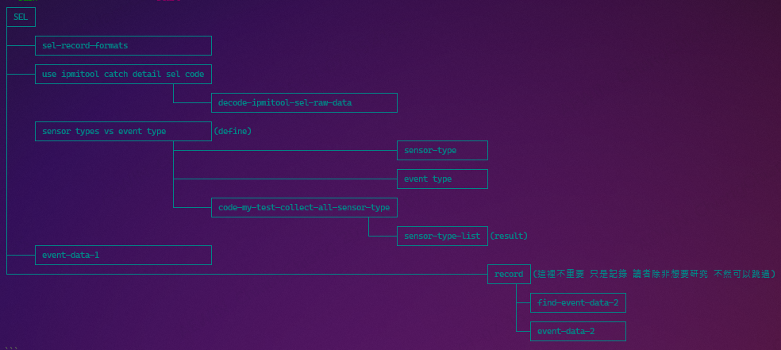
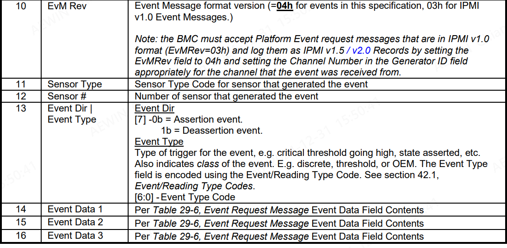
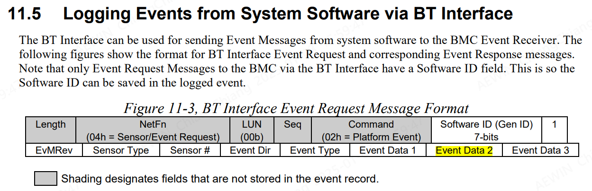
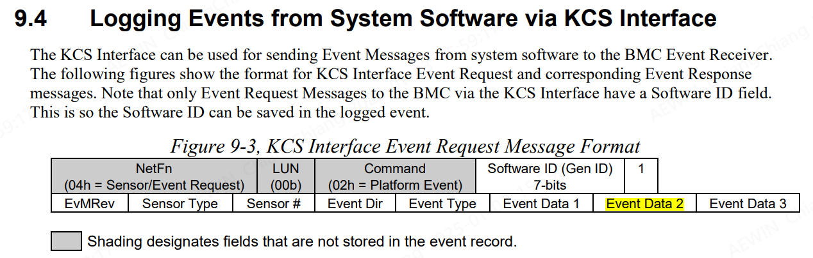
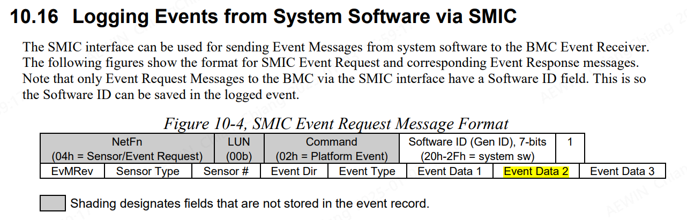
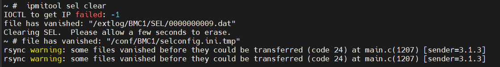

-------------------------------------------------------------------------------
created	;	Fri Dec 27 15:18:00 CST 2024

date	:	Tue Dec 31 16:13:48 CST 2024

[[ipmitool]]
[[sel]]
[ref](http://sd20-server.aewin.com/Chin_Chiang/lovecodingqueen_sop/-/blob/master/sel_1945.md)


-------------------------------------------------------------------------------

因為此文章比較多元素
所以讀者可以先對每一個章節有初步印象




# SEL #
這裡筆者要說明 在用SEL的幾個項目 與要   ~~筆者突然忘記要寫甚麼內容了.....~~

筆者這裡有看
`IPMI Intelligent Platform Management Interface Specification Second Generation v2.0 Document Revision 1.1 October 1,2013 April 21,2015 E7 Markup`
~~也太長了八.... 但是這就是 英文與中文的差別~~

首先筆者在單純的文件看不到SEL 的類別的部分(可能比者的能力稀薄...)
(所以筆者是用 code 的方式把所有 sel  的分類找到 再從這些分類中開始推到SRC中)

首先先我是用src來看前任寫的FUNCTION 再從這裡開始慢慢一點點滲透

```c			================start================
uint32_t IPMI_ADD_SEL_ENTRY(uint32_t timestamp, uint16_t sensor_info, uint32_t event_info, int32_t BMC_No)

IPMI_ADD_SEL_ENTRY(0x00, 0xD107, 0x6F8F0100, 1);
//                         │ │     │
//  ┌──────────────────────┘ │     │
//  │                        │     │
//  │                        │     │
//┌───────────────┬─────────────┬───────────┐
//│ D1            │ 07          │ 6F        │
//│───────────────┼─────────────┼───────────│
//│ sensor number │ sensor type │ event DIR │
//└───────────────┴─────────────┴───────────┘
//D1 -> sensor number -> it can random
//07 -> sensor type
//6F -> event DIR (6F ->assert EF -> deassert)

```

> In simpler terms, "asserting" means activating or triggering a particular signal or condition.
> This is a crucial part of how BMCs monitor and manage hardware components,
> ensuring that any issues are promptly detected and addressed.
>
> [reference] : bingGPT


在07的時候有問過彼大地
~~他說07是 event type 但經筆者多方查找 筆者定義為sensor type~~
~~只會接受不會思考是奴隸~~

## sel-record-formats ##
這時候請看 specification 460P 32.SEL record formats
| Byte | Field                       | Description                               |
|:----:|:---------------------------:|:-----------------------------------------:|
| 10   | EvM Rev                     | IPMI v1.5 / v2.0 Records by setting 04h   |
| 11   | [sensor type](#sensor-type) | code for sensor that generated the event  |
| 12   | sensor #                    | number of sensor that generated the event |
| 13   | Event Dir\|Event Type       |                                           |
| 13   | Event Dir                   | event dir [7]-0b=assertion 1b=deassertion |
| 13   | [Event Type](#event-type)   | Type of trigger for the event             |



## use ipmitool catch detail sel code ##

### decode-ipmitool-sel-raw-data ###
`/packages/common/packages/libAEWIN-src/data/sys_info/sel.c`
`uint32_t IPMI_ADD_SEL_ENTRY(uint32_t timestamp, uint16_t sensor_info, uint32_t event_info, int32_t BMC_No)`
`/packages/libipmipdk-ARM-AST2600-AST2600EVB-AMI-src/data/PDKInt.c`
`IPMI_ADD_SEL_ENTRY(0x00,0xF014,0x6F4034AE,1);`
```bash			================start================
#### bmc console
~ # ipmitool sel save /tmp/test
IOCTL to get IP failed: -1
   3 | 02/05/2000 | 01:16:28 | Button #0xf0 | Power Button pressed | Asserted
   4 | 02/05/2000 | 01:16:28 | Button #0xf0 | Power Button pressed | Asserted
~ #  cat /tmp/test
0x04 0x14 0xf0 0x6f 0x40 0x34 0xae # Button #0xf0 Power Button pressed
0x04 0x14 0xf0 0x6f 0x40 0x34 0xae # Button #0xf0 Power Button pressed
```

> 筆者這裡要說明 `ipmitool sel save /tmp/test`
> 存放的地方需要再 `/tmp`下
> 這是linux 的觀念 如果你任意存可能會有權限問題!

| EvM Rev                          | sensor type    | sensor number | event DIR | event data1            | data 2 | data 3 |
|:--------------------------------:|:--------------:|:-------------:|:---------:|:----------------------:|:------:|:------:|
| 0x04                             | 0x14           | 0xf0          | 0x6f      | 0x40                   | 0x34   | 0xae   |
| [ref-table](#sel-record-formats) | 0x14 == botton | any           | 6f OR EF  | [data1](#event-data-1) | any    | any    |

> 可以對前面的 [表格table](#sel-record-formats)

> note : 上面所說的 any 是代表可以任意選一個數字來取代

> sensor type 筆者後面的章節會說到 [chapter](#sensor-type-list)


這裡可以看出來
0xF014 (reverse) ====>0x14 0xF0
+ event dir[7]
  + 0x6F --> assert
  + 0xEF --> deassert


-------------------------------------------------------------------------------
## sensor types vs event type ##
this is form GPT

#### sensor-type ####

IPMI defines several sensor types, each monitoring different aspects of the system. Some common sensor types include1:
+ Temperature: Monitors system temperatures.
+ Voltage: Tracks voltage levels.
+ Current: Measures electrical current.
+ Fan: Monitors fan speeds.
+ Physical Security: Detects chassis intrusion and other security breaches.
+ Processor: Monitors CPU status and performance.
+ Power Supply: Tracks power supply status.
+ Memory: Monitors memory status.

#### **event type** ####

Event types in IPMI are used to report specific conditions or changes detected by sensors. Some examples include
+ Threshold-based Events: Triggered when sensor readings exceed predefined thresholds (e.g., temperature too high).
+ Discrete Events: Specific events like chassis intrusion or power supply failure.
+ Platform Events: General system events such as system boot, shutdown, or critical errors.

### code-my-test-collect-all-sensor-type  ###
```c			================start================
int love_switch(){
    static int love_pkdint = -1;
    love_pkdint++;
    int fn_send = 0;
    fn_send = love_pkdint%2;
    printf("%s -> (%s) : [%d] => [%d] \n",__FILE__,__func__,__LINE__,fn_send);
    return love_pkdint;
}

void AEWIN_GPIO_Interrupt_Handler(IPMI_INTInfo_T *IntInfo)
{
    printf("Get GPIO_PWRBTN_IN_N int\n");
    int tem_pwrbtn_love = love_switch();
    uint16_t sensor_info_love=0xFF00|tem_pwrbtn_love; ////OMG
    printf("LOVE QUEEN : [%6x]\n",sensor_info_love);
    printf("0x00,0x%x,6F520abc,1\n",sensor_info_love);
    IPMI_ADD_SEL_ENTRY(0x00,sensor_info_love,0x6F520abc,1);
}
```

#### sensor-type-list ####
[*back to decode sel raw data*](#decode-ipmitool-sel-raw-data)

| sensortype | des                            |
|:----------:|:------------------------------:|
| 0x0        | reserved #0xff                 |
| 0x1        | Temperature #0xff              |
| 0x2        | Voltage #0xff                  |
| 0x3        | Current #0xff                  |
| 0x4        | Fan #0xff                      |
| 0x5        | Physical Security #0xff        |
| 0x6        | Platform Security #0xff        |
| 0x7        | Processor #0xff                |
| 0x8        | Power Supply #0xff             |
| 0x9        | Power Unit #0xff               |
| 0xa        | Cooling Device #0xff           |
| 0xb        | Other #0xff                    |
| 0xc        | Memory #0xff                   |
| 0xd        | Drive Slot / Bay #0xff         |
| 0xe        | POST Memory Resize #0xff       |
| 0xf        | System Firmwares #0xff         |
| 0x10       | Event Logging Disabled #0xff   |
| 0x11       | Watchdog1 #0xff                |
| 0x12       | System Event #0xff             |
| 0x13       | Critical Interrupt #0xff       |
| 0x14       | Button #0xff                   |
| 0x15       | Module / Board #0xff           |
| 0x16       | Microcontroller #0xff          |
| 0x17       | Add-in Card #0xff              |
| 0x18       | Chassis #0xff                  |
| 0x19       | Chip Set #0xff                 |
| 0x1a       | Other FRU #0xff                |
| 0x1b       | Cable / Interconnect #0xff     |
| 0x1c       | Terminator #0xff               |
| 0x1d       | System Boot Initiated #0xff    |
| 0x1e       | Boot Error #0xff               |
| 0x1f       | OS Boot #0xff                  |
| 0x20       | OS Critical Stop #0xff         |
| 0x21       | Slot / Connector #0xff         |
| 0x22       | System ACPI Power State #0xff  |
| 0x23       | Watchdog2 #0xff                |
| 0x24       | Platform Alert #0xff           |
| 0x25       | Entity Presence #0xff          |
| 0x26       | Monitor ASIC #0xff             |
| 0x27       | LAN #0xff                      |
| 0x28       | Management Subsys Health #0xff |
| 0x29       | Battery #0xff                  |
| 0x2a       | Session Audit #0xff            |
| 0x2b       | Version Change #0xff           |
| 0x2c       | FRU State #0xff                |
| 0x2d       | Unknown #0xff                  |
| 0x2e       | Unknown #0xff                  |

example:
```bash			================start================
#   1 | 02/01/2000 | 20:23:19 | reserved #0xff |  | Asserted
#-> 0xFF00 => 00 => reserved
#  14 | 02/01/2000 | 20:25:08 | Critical Interrupt #0xff | I/O Channel check NMI | Asserted
#-> 0XFF13 => 13 => Critical Interrupt
```

## event-data-1 ##
[back to decode raw data](#decode-ipmitool-sel-raw-data)

I find the document a bit difficult to understand.
Here, I have derived this based on the SCR and the results.
This field will affect the subcategories under the main category

筆者在這裡是從一個錯誤的 `Button 0xf0 Unknown`
這裡的 Unknown
就是發現 event data 1 是sensor type 下的子類別項目

筆者在這裡 雖然沒有很懂 但是從結果來推倒答案
我想是一個很簡單的事情

筆者單純改變`event data 1` 來測試

+ raw data 第5個
0x04 0x14 0xf0 0x6f **0xgg** 0x00 0x00 # Button #0xf0 Power Button pressed

| EvM Rev | sensor type | sensor # | event Dir | data1      | data2 | data3 |
|:-------:|:-----------:|:--------:|:---------:|:----------:|:-----:|:-----:|
| 0x04    | 0x14        | 0xf0     | 0x6f      | **0xgg**   | 0x22  | 0x33  |
|         |             |          |           | 這裡的主角 |       |       |

+ [code](#sel)
-> `uint32_t event_info`
0x6F**10**2233

| event DIR | data1 | data2 | data3 |
|:---------:|:-----:|:-----:|:-----:|
| 6F        | 10    | 22    | 33    |

```bash			================start================
0x04 0x14 0xf0 0x6f   0xVA   0x00 0x00 # emphasize
////				    | |
////				    | |
////				    \ /
////				     V
0x04 0x14 0xf0 0x6f   0x00   0x00 0x00 # Button #0xf0 Power Button pressed
0x04 0x14 0xf0 0x6f   0x01   0x00 0x00 # Button #0xf0 Sleep Button pressed
0x04 0x14 0xf0 0x6f   0x02   0x00 0x00 # Button #0xf0 Reset Button pressed
0x04 0x14 0xf0 0x6f   0x03   0x00 0x00 # Button #0xf0 FRU Latch
0x04 0x14 0xf0 0x6f   0x04   0x00 0x00 # Button #0xf0 FRU Service
0x04 0x14 0xf0 0x6f   0x05   0x00 0x00 # Button #0xf0 Unknown
0x04 0x14 0xf0 0x6f   0x06   0x00 0x00 # Button #0xf0 Unknown
0x04 0x14 0xf0 0x6f   0x07   0x00 0x00 # Button #0xf0 Unknown
0x04 0x14 0xf0 0x6f   0x08   0x00 0x00 # Button #0xf0 Unknown
0x04 0x14 0xf0 0x6f   0x09   0x00 0x00 # Button #0xf0 Unknown
0x04 0x14 0xf0 0x6f   0x0a   0x00 0x00 # Button #0xf0 Unknown
0x04 0x14 0xf0 0x6f   0x0b   0x00 0x00 # Button #0xf0 Unknown
0x04 0x14 0xf0 0x6f   0x0c   0x00 0x00 # Button #0xf0 Unknown
0x04 0x14 0xf0 0x6f   0x0d   0x00 0x00 # Button #0xf0 Unknown
0x04 0x14 0xf0 0x6f   0x0e   0x00 0x00 # Button #0xf0 Unknown
0x04 0x14 0xf0 0x6f   0x0f   0x00 0x00 # Button #0xf0 Unknown
0x04 0x14 0xf0 0x6f   0x10   0x00 0x00 # Button #0xf0 Power Button pressed
0x04 0x14 0xf0 0x6f   0x11   0x00 0x00 # Button #0xf0 Sleep Button pressed
0x04 0x14 0xf0 0x6f   0x12   0x00 0x00 # Button #0xf0 Reset Button pressed
0x04 0x14 0xf0 0x6f   0x13   0x00 0x00 # Button #0xf0 FRU Latch
0x04 0x14 0xf0 0x6f   0x14   0x00 0x00 # Button #0xf0 FRU Service
0x04 0x14 0xf0 0x6f   0x15   0x00 0x00 # Button #0xf0 Unknown
0x04 0x14 0xf0 0x6f   0x16   0x00 0x00 # Button #0xf0 Unknown
0x04 0x14 0xf0 0x6f   0x17   0x00 0x00 # Button #0xf0 Unknown
0x04 0x14 0xf0 0x6f   0x18   0x00 0x00 # Button #0xf0 Unknown
0x04 0x14 0xf0 0x6f   0x19   0x00 0x00 # Button #0xf0 Unknown
0x04 0x14 0xf0 0x6f   0x1a   0x00 0x00 # Button #0xf0 Unknown
0x04 0x14 0xf0 0x6f   0x1b   0x00 0x00 # Button #0xf0 Unknown
0x04 0x14 0xf0 0x6f   0x1c   0x00 0x00 # Button #0xf0 Unknown
0x04 0x14 0xf0 0x6f   0x1d   0x00 0x00 # Button #0xf0 Unknown
0x04 0x14 0xf0 0x6f   0x1e   0x00 0x00 # Button #0xf0 Unknown
0x04 0x14 0xf0 0x6f   0x1f   0x00 0x00 # Button #0xf0 Unknown
0x04 0x14 0xf0 0x6f   0x20   0x00 0x00 # Button #0xf0 Power Button pressed
```
因為實在太多筆者就只放部分 畢竟有規律的事情是最好掌握的

1. 可以得到 event data 1 -> 是小分類:
依照button的大類別下面有5個
    + Power Button pressed
    (0x_0)
    + Sleep Button pressed
    (0x_1)
    + Reset Button pressed
    (0x_2)
    + FRU Latch
    (0x_3)
    + FRU Service
    (0x_4)

筆者有追code 在後面的PART會說到

> note : 有此可知 在raw data 中 他的event data 1 只看最後一個位元來決定

📂file:`/packages/common/packages/ipmitool-src/data/include/ipmitool/ipmi_sel.h`
```c			================start================
    /* Button */
    { 0x14, 0x00, 0xff, "Power Button pressed" },
    { 0x14, 0x01, 0xff, "Sleep Button pressed" },
    { 0x14, 0x02, 0xff, "Reset Button pressed" },
    { 0x14, 0x03, 0xff, "FRU Latch" },
    { 0x14, 0x04, 0xff, "FRU Service" },
///// 0x14 ->  button category
```
📂file:`/packages/common/packages/libEventLogDes-src/data/libEventLogDes.c`
```c			================start================
SenType_T Sen_Type [] =
{
    {0x00, "Reserved"},
    {0x01, "Temperature"},
    {0x02, "Voltage"},
    {0x03, "Current"},
    {0x04, "Fan"},
    {0x05, "Physical Security"},
    {0x06, "Platform Security"},
    {0x07, "Processor"},
    {0x08, "Power Supply"},
    {0x09, "Power Unit"},
    {0x0a, "Cooling Device"},
    {0x0b, "Other Units-Based Sensor"},
    {0x0c, "Memory"},
    {0x0d, "Drive Slot (Bay)"},
    {0x0e, "POST Memory Resize"},
    {0x0f, "System  Firmware Progress"},
    {0x10, "Event Logging Disabled"},
    {0x11, "Watchdog 1"},
    {0x12, "System Event"},
    {0x13, "Critical Interrupt"},
    {0x14, "Button / Switch"},
    {0x15, "Module / Board"},
    {0x16, "Microcontroller /Coprocessor"},
    {0x17, "Add-in Card"},
    {0x18, "Chassis"},
    {0x19, "CHip Set"},
    {0x1a, "Other FRU"},
    {0x1b, "Cable / Interconnect"},
    {0x1c, "Terminator"},
    {0x1d, "System Boot / Restart"},
    {0x1e, "Boot Error"},
    {0x1f, "OS Boot"},
    {0x20, "OS Stop / Shutdown"},
    {0x21, "Slot  / Connector"},
    {0x22, "System ACPI Power State"},
    {0x23, "Watchdog 2"},
    {0x24, "Platform Alert"},
    {0x25, "Entity Presence"},
    {0x26, "Monitor Asic / Ic"},
    {0x27, "Lan"},
    {0x28, "Management Subsystem"},
    {0x29, "Battery"},
    {0x2a, "Session Audit"},
    {0x2b, "Version Change"},
    {0x2c, "Fru State"}
};

/*Sensor Types*/
SenType_T Sen_Type [] =
{
    // 0 to 4 for 14h
    {0x14, 0x00, "Power Button pressed"},
    {0x14, 0x01, "Sleep Button pressed"},
    {0x14, 0x02, "Reset Button pressed"},
    {0x14, 0x03, "FRU latch open"},
    {0x14, 0x04, "FRU service request button"},
}
```
📂file: `/packages/common/packages/SMASH_LITE-src/data/Source/SM_libipmi_interface.c`
```c			================start================
int getSELRecordData(SELEventRecord_T *ptrToSELRecord,char *propVal)
{
uint8 offset = 0;
offset = ptrToSELRecord->EvtData1 & 0x0f;
else if(ptrToSELRecord->SensorType == 0x14)
    {
#ifdef CONFIG_SPX_FEATURE_SMASH_LITE_SCORPIO
    snprintf(eventString,SENSOR_EVENT_STR_LEN,"%s    #%x ","Button/Switch",ptrToSELRecord->SensorNum);
#else
    strcat(eventString,"Button/Switch");
#endif
        if(offset == 0x00)
            strcat(eventString," - Power Button pressed");
        else if(offset == 0x01)
            strcat(eventString," - Sleep Button pressed");
        else if(offset == 0x02)
            strcat(eventString," - Reset Button pressed");
        else if(offset == 0x03)
            strcat(eventString," - FRU latch open");
        else if(offset == 0x04)
            strcat(eventString," - FRU service request button");
    }
}
```

-------------------------------------------------------------------------------

##### record #####


```bash			================start================
~ #  ipmitool sel save /tmp/tem.txt
IOCTL to get IP failed: -1
  2c | 01/23/2000 | 04:12:27 | Voltage #0x65 | Lower Non-recoverable going low  | Asserted
  2d | 01/23/2000 | 04:12:27 | Voltage #0x66 | Lower Non-recoverable going low  | Asserted
  2e | 01/23/2000 | 04:12:37 | Fan #0x67 | Lower Non-recoverable going low  | Asserted
  2f | 01/23/2000 | 04:18:16 | Power Supply #0x60 |  | Asserted
   1 | 01/30/2000 | 00:13:29 | Fan #0x40 | Lower Non-recoverable going low  | Asserted
   2 | 01/30/2000 | 04:59:21 | Power Supply #0x60 |  | Asserted
   3 | 01/30/2000 | 04:59:21 | Power Supply #0x64 |  | Asserted
   4 | 01/30/2000 | 04:59:21 | Voltage #0x65 | Lower Non-recoverable going low  | Asserted
   5 | 01/30/2000 | 23:18:20 | Fan #0x40 | Lower Non-recoverable going low  | Asserted
```
```bash			================start================
~ #   cat /tmp/tem.txt
0x04 0x02 0x65 0x01 0x54 0x00 0x5a # Voltage #0x65 Lower Non-recoverable going low
0x04 0x02 0x66 0x01 0x54 0x00 0x58 # Voltage #0x66 Lower Non-recoverable going low
0x04 0x04 0x67 0x01 0x54 0x00 0x00 # Fan #0x67 Lower Non-recoverable going low
0x04 0x08 0x60 0x6f 0xa8 0x08 0x20 # Power Supply #0x60 Unknown
0x04 0x04 0x40 0x01 0x54 0x00 0x05 # Fan #0x40 Lower Non-recoverable going low
0x04 0x08 0x60 0x6f 0xa8 0x00 0x20 # Power Supply #0x60 Unknown
0x04 0x08 0x64 0x6f 0xa8 0x00 0x20 # Power Supply #0x64 Unknown
0x04 0x02 0x65 0x01 0x54 0x07 0x5a # Voltage #0x65 Lower Non-recoverable going low
0x04 0x04 0x40 0x01 0x54 0x00 0x05 # Fan #0x40 Lower Non-recoverable going low

0x04 : event revision
0x02 : sensor type  (Record Type)
0x65 : sensor number
0x01 : event DIR + event type (???)

```

###### find-event-data-2 ######

筆者也是需要去多方比較 這麼說呢
意思就是 因為的確在code的方面
他們寫的功能不是那麼清晰(我單純說的是data2 or data3)

所以筆者就開始翻找

code的地方 他有幾個part 有關係

在
`/packages/common/packages/libipmimsghndlr-src/data/SensorEvent/SensorDevice/internal_sensor.c`
`/packages/common/packages/libipmimsghndlr-src/data/Transport/Badpasswd.c`

在AMI裡面 並沒有 event data2 or event data3的定義code

但是在 specification 有部分

說明 data2的會有部分的各式




```bash			================start================
~ #  cat /tmp/test
0x04 0x08 0xf0 0x6f 0x00 0x00 0x00 # Power Supply #0xf0 Presence detected
0x04 0x08 0xf0 0x6f 0x01 0x00 0x00 # Power Supply #0xf0 Failure detected
0x04 0x08 0xf0 0x6f 0x02 0x00 0x00 # Power Supply #0xf0 Predictive failure
0x04 0x08 0xf0 0x6f 0x03 0x00 0x00 # Power Supply #0xf0 Power Supply AC lost
0x04 0x08 0xf0 0x6f 0x04 0x00 0x00 # Power Supply #0xf0 AC lost or out-of-range
0x04 0x08 0xf0 0x6f 0x05 0x00 0x00 # Power Supply #0xf0 AC out-of-range, but present
0x04 0x08 0xf0 0x6f 0x06 0x00 0x00 # Power Supply #0xf0 Config Error
0x04 0x08 0xf0 0x6f 0x07 0x00 0x00 # Power Supply #0xf0 Unknown
0x04 0x08 0xf0 0x6f 0x08 0x00 0x00 # Power Supply #0xf0 Unknown
0x04 0x08 0xf0 0x6f 0x09 0x00 0x00 # Power Supply #0xf0 Unknown
0x04 0x08 0xf0 0x6f 0x0a 0x00 0x00 # Power Supply #0xf0 Unknown
0x04 0x08 0xf0 0x6f 0x0b 0x00 0x00 # Power Supply #0xf0 Unknown
0x04 0x08 0xf0 0x6f 0x0c 0x00 0x00 # Power Supply #0xf0 Unknown
0x04 0x08 0xf0 0x6f 0x0d 0x00 0x00 # Power Supply #0xf0 Unknown
0x04 0x08 0xf0 0x6f 0x0e 0x00 0x00 # Power Supply #0xf0 Unknown
0x04 0x08 0xf0 0x6f 0x0f 0x00 0x00 # Power Supply #0xf0 Unknown
0x04 0x08 0xf0 0x6f 0x10 0x00 0x00 # Power Supply #0xf0 Presence detected
0x04 0x08 0xf0 0x6f 0x11 0x00 0x00 # Power Supply #0xf0 Failure detected
0x04 0x08 0xf0 0x6f 0x12 0x00 0x00 # Power Supply #0xf0 Predictive failure
0x04 0x08 0xf0 0x6f 0x13 0x00 0x00 # Power Supply #0xf0 Power Supply AC lost
0x04 0x08 0xf0 0x6f 0x14 0x00 0x00 # Power Supply #0xf0 AC lost or out-of-range
0x04 0x08 0xf0 0x6f 0x15 0x00 0x00 # Power Supply #0xf0 AC out-of-range, but present
0x04 0x08 0xf0 0x6f 0x16 0x00 0x00 # Power Supply #0xf0 Config Error
0x04 0x08 0xf0 0x6f 0x17 0x00 0x00 # Power Supply #0xf0 Unknown
0x04 0x08 0xf0 0x6f 0x18 0x00 0x00 # Power Supply #0xf0 Unknown
0x04 0x08 0xf0 0x6f 0x19 0x00 0x00 # Power Supply #0xf0 Unknown
0x04 0x08 0xf0 0x6f 0x1a 0x00 0x00 # Power Supply #0xf0 Unknown
0x04 0x08 0xf0 0x6f 0x1b 0x00 0x00 # Power Supply #0xf0 Unknown
0x04 0x08 0xf0 0x6f 0x1c 0x00 0x00 # Power Supply #0xf0 Unknown
0x04 0x08 0xf0 0x6f 0x1d 0x00 0x00 # Power Supply #0xf0 Unknown
0x04 0x08 0xf0 0x6f 0x1e 0x00 0x00 # Power Supply #0xf0 Unknown
0x04 0x08 0xf0 0x6f 0x1f 0x00 0x00 # Power Supply #0xf0 Unknown
0x04 0x08 0xf0 0x6f 0x20 0x00 0x00 # Power Supply #0xf0 Presence detected
```
```bash			================start================
~ #  cat /tmp/test
0x04 0x08 0xf0 0x6f 0x06 0x00 0x00 # Power Supply #0xf0 Config Error
0x04 0x08 0xf0 0x6f 0x06 0x01 0x00 # Power Supply #0xf0 Config Error
0x04 0x08 0xf0 0x6f 0x06 0x02 0x00 # Power Supply #0xf0 Config Error
0x04 0x08 0xf0 0x6f 0x06 0x03 0x00 # Power Supply #0xf0 Config Error
0x04 0x08 0xf0 0x6f 0x06 0x04 0x00 # Power Supply #0xf0 Config Error
0x04 0x08 0xf0 0x6f 0x06 0x05 0x00 # Power Supply #0xf0 Config Error
0x04 0x08 0xf0 0x6f 0x06 0x06 0x00 # Power Supply #0xf0 Config Error
0x04 0x08 0xf0 0x6f 0x06 0x07 0x00 # Power Supply #0xf0 Config Error
0x04 0x08 0xf0 0x6f 0x06 0x08 0x00 # Power Supply #0xf0 Config Error
0x04 0x08 0xf0 0x6f 0x06 0x09 0x00 # Power Supply #0xf0 Config Error
0x04 0x08 0xf0 0x6f 0x06 0x0a 0x00 # Power Supply #0xf0 Config Error
0x04 0x08 0xf0 0x6f 0x06 0x0b 0x00 # Power Supply #0xf0 Config Error
0x04 0x08 0xf0 0x6f 0x06 0x0c 0x00 # Power Supply #0xf0 Config Error
0x04 0x08 0xf0 0x6f 0x06 0x0d 0x00 # Power Supply #0xf0 Config Error
0x04 0x08 0xf0 0x6f 0x06 0x0e 0x00 # Power Supply #0xf0 Config Error
0x04 0x08 0xf0 0x6f 0x06 0x0f 0x00 # Power Supply #0xf0 Config Error
0x04 0x08 0xf0 0x6f 0x06 0x10 0x00 # Power Supply #0xf0 Config Error
0x04 0x08 0xf0 0x6f 0x06 0x11 0x00 # Power Supply #0xf0 Config Error
0x04 0x08 0xf0 0x6f 0x06 0x12 0x00 # Power Supply #0xf0 Config Error
0x04 0x08 0xf0 0x6f 0x06 0x13 0x00 # Power Supply #0xf0 Config Error
0x04 0x08 0xf0 0x6f 0x06 0x14 0x00 # Power Supply #0xf0 Config Error
0x04 0x08 0xf0 0x6f 0x06 0x15 0x00 # Power Supply #0xf0 Config Error
0x04 0x08 0xf0 0x6f 0x06 0x16 0x00 # Power Supply #0xf0 Config Error
0x04 0x08 0xf0 0x6f 0x06 0x17 0x00 # Power Supply #0xf0 Config Error
0x04 0x08 0xf0 0x6f 0x06 0x18 0x00 # Power Supply #0xf0 Config Error
0x04 0x08 0xf0 0x6f 0x06 0x19 0x00 # Power Supply #0xf0 Config Error
0x04 0x08 0xf0 0x6f 0x06 0x1a 0x00 # Power Supply #0xf0 Config Error
```

這裡筆者以為是 event data 2 可以修
(但是結果卻不是)


📂 file:`/mnt/AEWIN/codebase/malo/ast2600evb/packages/common/packages/ipmitool-src/data/include/ipmitool/ipmi_sel.h`
```c			================start================
struct ipmi_event_sensor_types {
	uint8_t	code;	//sensor type
    uint8_t	offset; //event data 1
#define ALL_OFFSETS_SPECIFIED  0xff
	uint8_t   data;
	const char	* desc;
};
```

```bash			================start================
~ #  Get GPIO_PWRBTN_IN_N int
 get :  [     0]
 ==> [6f060000]
 get :  [   100]
 ==> [6f060100]
 get :  [   200]
 ==> [6f060200]
 get :  [   300]
 ==> [6f060300]
 get :  [   400]
 ==> [6f060400]
 get :  [   500]
 ==> [6f060500]
 get :  [   600]
 ==> [6f060600]
 get :  [   700]
 ==> [6f060700]
 get :  [   800]
 ==> [6f060800]
 get :  [   900]
 ==> [6f060900]
 get :  [   a00]
 ==> [6f060a00]
 get :  [   b00]
 ==> [6f060b00]
 get :  [   c00]
 ==> [6f060c00]
 get :  [   d00]
 ==> [6f060d00]
 get :  [   e00]
 ==> [6f060e00]
 get :  [   f00]
 ==> [6f060f00]
 get :  [  1000]
 ==> [6f061000]
 get :  [  1100]
 ==> [6f061100]
 get :  [  1200]
 ==> [6f061200]
 get :  [  1300]
 ==> [6f061300]
 get :  [  1400]
 ==> [6f061400]
 get :  [  1500]
 ==> [6f061500]
 get :  [  1600]
 ==> [6f061600]
 get :  [  1700]
 ==> [6f061700]
 get :  [  1800]
 ==> [6f061800]
 get :  [  1900]
 ==> [6f061900]
 get :  [  1a00]
 ==> [6f061a00]
 get :  [  1b00]
 ==> [6f061b00]
 get :  [  1c00]
 ==> [6f061c00]
 get :  [  1d00]
 ==> [6f061d00]
 get :  [  1e00]
 ==> [6f061e00]
 get :  [  1f00]
 ==> [6f061f00]
 get :  [  2000]
 ==> [6f062000]
 get :  [  2100]
 ==> [6f062100]
 get :  [  2200]
 ==> [6f062200]
 get :  [  2300]
 ==> [6f062300]
 get :  [  2400]
 ==> [6f062400]
 get :  [  2500]
 ==> [6f062500]
 get :  [  2600]
 ==> [6f062600]
 get :  [  2700]
 ==> [6f062700]
 get :  [  2800]
 ==> [6f062800]
 get :  [  2900]
 ==> [6f062900]
 get :  [  2a00]
 ==> [6f062a00]
file has vanished: "/extlog/BMC1/SEL/0000000001_t.dat"
 get :  [  2b00]
 ==> [6f062b00]
 get :  [  2c00]
 ==> [6f062c00]
 get :  [  2d00]
 ==> [6f062d00]
 get :  [  2e00]
 ==> [6f062e00]
 get :  [  2f00]
 ==> [6f062f00]
 get :  [  3000]
 ==> [6f063000]
 get :  [  3100]
 ==> [6f063100]
 get :  [  3200]
 ==> [6f063200]
 get :  [  3300]
 ==> [6f063300]
 get :  [  3400]
 ==> [6f063400]
 get :  [  3500]
 ==> [6f063500]
 get :  [  3600]
 ==> [6f063600]
 get :  [  3700]
 ==> [6f063700]
 get :  [  3800]
 ==> [6f063800]
 get :  [  3900]
 ==> [6f063900]
 get :  [  3a00]
 ==> [6f063a00]
 get :  [  3b00]
 ==> [6f063b00]
 get :  [  3c00]
 ==> [6f063c00]
 get :  [  3d00]
 ==> [6f063d00]
 get :  [  3e00]
 ==> [6f063e00]
 get :  [  3f00]
 ==> [6f063f00]
 get :  [  4000]
 ==> [6f064000]
 get :  [  4100]
 ==> [6f064100]
 get :  [  4200]
 ==> [6f064200]
 get :  [  4300]
 ==> [6f064300]
 get :  [  4400]
 ==> [6f064400]
 get :  [  4500]
 ==> [6f064500]
 get :  [  4600]
 ==> [6f064600]
 get :  [  4700]
 ==> [6f064700]
 get :  [  4800]
 ==> [6f064800]
 get :  [  4900]
 ==> [6f064900]
 get :  [  4a00]
 ==> [6f064a00]
rsync warning: some files vanished before they could be transferred (code 24) at main.c(1207) [sender=3.1.3]
 get :  [  4b00]
 ==> [6f064b00]
 get :  [  4c00]
 ==> [6f064c00]
 get :  [  4d00]
 ==> [6f064d00]
 get :  [  4e00]
 ==> [6f064e00]
 get :  [  4f00]
 ==> [6f064f00]
 get :  [  5000]
 ==> [6f065000]
 get :  [  5100]
 ==> [6f065100]
 get :  [  5200]
 ==> [6f065200]
 get :  [  5300]
 ==> [6f065300]
 get :  [  5400]
 ==> [6f065400]
 get :  [  5500]
 ==> [6f065500]
 get :  [  5600]
 ==> [6f065600]
 get :  [  5700]
 ==> [6f065700]
 get :  [  5800]
 ==> [6f065800]
 get :  [  5900]
 ==> [6f065900]
 get :  [  5a00]
 ==> [6f065a00]
 get :  [  5b00]
 ==> [6f065b00]
 get :  [  5c00]
 ==> [6f065c00]
 get :  [  5d00]
 ==> [6f065d00]
 get :  [  5e00]
 ==> [6f065e00]
 get :  [  5f00]
 ==> [6f065f00]
 get :  [  6000]
 ==> [6f066000]
 get :  [  6100]
 ==> [6f066100]
 get :  [  6200]
 ==> [6f066200]
 get :  [  6300]
 ==> [6f066300]
Get GPIO_PWRBTN_IN_N int
 get :  [  6400]
 ==> [6f066400]
 get :  [  6500]
 ==> [6f066500]
 get :  [  6600]
 ==> [6f066600]
 get :  [  6700]
 ==> [6f066700]
 get :  [  6800]
 ==> [6f066800]
 get :  [  6900]
 ==> [6f066900]
 get :  [  6a00]
 ==> [6f066a00]
 get :  [  6b00]
 ==> [6f066b00]
 get :  [  6c00]
 ==> [6f066c00]
 get :  [  6d00]
 ==> [6f066d00]
file has vanished: "/extlog/BMC1/selreclaiminfo.ini.tmp"
 get :  [  6e00]
 ==> [6f066e00]
 get :  [  6f00]
 ==> [6f066f00]
 get :  [  7000]
 ==> [6f067000]
 get :  [  7100]
 ==> [6f067100]
 get :  [  7200]
 ==> [6f067200]
 get :  [  7300]
 ==> [6f067300]
 get :  [  7400]
 ==> [6f067400]
 get :  [  7500]
 ==> [6f067500]
 get :  [  7600]
 ==> [6f067600]
 get :  [  7700]
 ==> [6f067700]
 get :  [  7800]
 ==> [6f067800]
 get :  [  7900]
 ==> [6f067900]
 get :  [  7a00]
 ==> [6f067a00]
 get :  [  7b00]
 ==> [6f067b00]
 get :  [  7c00]
 ==> [6f067c00]
 get :  [  7d00]
 ==> [6f067d00]
 get :  [  7e00]
 ==> [6f067e00]
 get :  [  7f00]
 ==> [6f067f00]
 get :  [  8000]
 ==> [6f068000]
 get :  [  8100]
 ==> [6f068100]
 get :  [  8200]
 ==> [6f068200]
 get :  [  8300]
 ==> [6f068300]
 get :  [  8400]
 ==> [6f068400]
 get :  [  8500]
 ==> [6f068500]
rsync warning: some files vanished before they could be transferred (code 24) at main.c(1207) [sender=3.1.3]
 get :  [  8600]
 ==> [6f068600]
 get :  [  8700]
 ==> [6f068700]
 get :  [  8800]
 ==> [6f068800]
 get :  [  8900]
 ==> [6f068900]
 get :  [  8a00]
 ==> [6f068a00]
 get :  [  8b00]
 ==> [6f068b00]
 get :  [  8c00]
 ==> [6f068c00]
 get :  [  8d00]
 ==> [6f068d00]
 get :  [  8e00]
 ==> [6f068e00]
 get :  [  8f00]
 ==> [6f068f00]
 get :  [  9000]
 ==> [6f069000]
 get :  [  9100]
 ==> [6f069100]
 get :  [  9200]
 ==> [6f069200]
 get :  [  9300]
 ==> [6f069300]
 get :  [  9400]
 ==> [6f069400]
 get :  [  9500]
 ==> [6f069500]
 get :  [  9600]
 ==> [6f069600]
 get :  [  9700]
 ==> [6f069700]
 get :  [  9800]
 ==> [6f069800]
 get :  [  9900]
 ==> [6f069900]
 get :  [  9a00]
 ==> [6f069a00]
 get :  [  9b00]
 ==> [6f069b00]
 get :  [  9c00]
 ==> [6f069c00]
 get :  [  9d00]
 ==> [6f069d00]
 get :  [  9e00]
 ==> [6f069e00]
 get :  [  9f00]
 ==> [6f069f00]
 get :  [  a000]
 ==> [6f06a000]
 get :  [  a100]
 ==> [6f06a100]
 get :  [  a200]
 ==> [6f06a200]
 get :  [  a300]
 ==> [6f06a300]
 get :  [  a400]
 ==> [6f06a400]
 get :  [  a500]
 ==> [6f06a500]
 get :  [  a600]
 ==> [6f06a600]
 get :  [  a700]
 ==> [6f06a700]
 get :  [  a800]
 ==> [6f06a800]
 get :  [  a900]
 ==> [6f06a900]
 get :  [  aa00]
 ==> [6f06aa00]
 get :  [  ab00]
 ==> [6f06ab00]
file has vanished: "/extlog/BMC1/selreclaiminfo.ini.tmp"
 get :  [  ac00]
 ==> [6f06ac00]
 get :  [  ad00]
 ==> [6f06ad00]
 get :  [  ae00]
 ==> [6f06ae00]
 get :  [  af00]
 ==> [6f06af00]
 get :  [  b000]
 ==> [6f06b000]
 get :  [  b100]
 ==> [6f06b100]
 get :  [  b200]
 ==> [6f06b200]
 get :  [  b300]
 ==> [6f06b300]
 get :  [  b400]
 ==> [6f06b400]
 get :  [  b500]
 ==> [6f06b500]
 get :  [  b600]
 ==> [6f06b600]
 get :  [  b700]
 ==> [6f06b700]
 get :  [  b800]
 ==> [6f06b800]
 get :  [  b900]
 ==> [6f06b900]
 get :  [  ba00]
 ==> [6f06ba00]
 get :  [  bb00]
 ==> [6f06bb00]
 get :  [  bc00]
 ==> [6f06bc00]
 get :  [  bd00]
 ==> [6f06bd00]
 get :  [  be00]
 ==> [6f06be00]
 get :  [  bf00]
 ==> [6f06bf00]
 get :  [  c000]
 ==> [6f06c000]
 get :  [  c100]
 ==> [6f06c100]
 get :  [  c200]
 ==> [6f06c200]
 get :  [  c300]
 ==> [6f06c300]
 get :  [  c400]
 ==> [6f06c400]
 get :  [  c500]
 ==> [6f06c500]
 get :  [  c600]
 ==> [6f06c600]
 get :  [  c700]
 ==> [6f06c700]
rsync warning: some files vanished before they could be transferred (code 24) at main.c(1207) [sender=3.1.3]
```

###### event-data-2 ######

```bash			================start================
~ #  ipmitool sel clear
IOCTL to get IP failed: -1
file has vanished: "/extlog/BMC1/SEL/0000000009.dat"
Clearing SEL.  Please allow a few seconds to erase.
~ # file has vanished: "/conf/BMC1/selconfig.ini.tmp"
rsync warning: some files vanished before they could be transferred (code 24) at main.c(1207) [sender=3.1.3]
rsync warning: some files vanished before they could be transferred (code 24) at main.c(1207) [sender=3.1.3]
```


筆者這裡因為跟john大神討論過
他說是否找到 event data 2 or event data 3
是否也會影響
所以筆者有找到(這裡的找到是由 AMI 的code)
file 📂 : `/packages/ipmitool-src/data/include/ipmitool/ipmi_sel.h`
```c			================start================
    /* Version Change */
    { 0x2b, 0x00, 0xff, "Hardware change detected" },
    { 0x2b, 0x01, 0x00, "Firmware or software change detected" },
    { 0x2b, 0x01, 0x01, "Firmware or software change detected, Mngmt Ctrl Dev Id" },
    { 0x2b, 0x01, 0x02, "Firmware or software change detected, Mngmt Ctrl Firm Rev" },
    { 0x2b, 0x01, 0x03, "Firmware or software change detected, Mngmt Ctrl Dev Rev" },
    { 0x2b, 0x01, 0x04, "Firmware or software change detected, Mngmt Ctrl Manuf Id" },
    { 0x2b, 0x01, 0x05, "Firmware or software change detected, Mngmt Ctrl IPMI Vers" },
    { 0x2b, 0x01, 0x06, "Firmware or software change detected, Mngmt Ctrl Aux Firm Id" },
    { 0x2b, 0x01, 0x07, "Firmware or software change detected, Mngmt Ctrl Firm Boot Block" },
    { 0x2b, 0x01, 0x08, "Firmware or software change detected, Mngmt Ctrl Other" },
    { 0x2b, 0x01, 0x09, "Firmware or software change detected, BIOS/EFI change" },
    { 0x2b, 0x01, 0x0A, "Firmware or software change detected, SMBIOS change" },
    { 0x2b, 0x01, 0x0B, "Firmware or software change detected, O/S change" },
    { 0x2b, 0x01, 0x0C, "Firmware or software change detected, O/S loader change" },
    { 0x2b, 0x01, 0x0D, "Firmware or software change detected, Service Diag change" },
    { 0x2b, 0x01, 0x0E, "Firmware or software change detected, Mngmt SW agent change" },
    { 0x2b, 0x01, 0x0F, "Firmware or software change detected, Mngmt SW App change" },
    { 0x2b, 0x01, 0x10, "Firmware or software change detected, Mngmt SW Middle" },
    { 0x2b, 0x01, 0x11, "Firmware or software change detected, Prog HW Change (FPGA)" },
    { 0x2b, 0x01, 0x12, "Firmware or software change detected, board/FRU module change" },
    { 0x2b, 0x01, 0x13, "Firmware or software change detected, board/FRU component change" },
    { 0x2b, 0x01, 0x14, "Firmware or software change detected, board/FRU replace equ ver" },
    { 0x2b, 0x01, 0x15, "Firmware or software change detected, board/FRU replace new ver" },
    { 0x2b, 0x01, 0x16, "Firmware or software change detected, board/FRU replace old ver" },
    { 0x2b, 0x01, 0x17, "Firmware or software change detected, board/FRU HW conf change" },
    { 0x2b, 0x02, 0xff, "Hardware incompatibility detected" },
    { 0x2b, 0x03, 0xff, "Firmware or software incompatibility detected" },
```
> note : 筆者這裡只有放部分 因為是舉例 如果想看
> 請讀者自行打開這PART

```bash			================start================
~ # ipmitool sel list
IOCTL to get IP failed: -1
   1 | 02/13/2000 | 00:03:27 | Version Change #0xf0 |  | Asserted
   2 | 02/13/2000 | 00:03:27 | Version Change #0xf0 |  | Asserted
   3 | 02/13/2000 | 00:03:27 | Version Change #0xf0 |  | Asserted
   4 | 02/13/2000 | 00:03:27 | Version Change #0xf0 |  | Asserted
   5 | 02/13/2000 | 00:03:27 | Version Change #0xf0 |  | Asserted
   6 | 02/13/2000 | 00:03:27 | Version Change #0xf0 |  | Asserted
   7 | 02/13/2000 | 00:03:27 | Version Change #0xf0 |  | Asserted
   8 | 02/13/2000 | 00:03:27 | Version Change #0xf0 |  | Asserted
   9 | 02/13/2000 | 00:03:27 | Version Change #0xf0 |  | Asserted
   a | 02/13/2000 | 00:03:27 | Version Change #0xf0 |  | Asserted
   b | 02/13/2000 | 00:03:27 | Version Change #0xf0 |  | Asserted
   c | 02/13/2000 | 00:03:27 | Version Change #0xf0 |  | Asserted
   d | 02/13/2000 | 00:03:27 | Version Change #0xf0 | Hardware incompatibility detected | Asserted
   e | 02/13/2000 | 00:03:27 | Version Change #0xf0 | Hardware incompatibility detected | Asserted
   f | 02/13/2000 | 00:03:27 | Version Change #0xf0 | Hardware incompatibility detected | Asserted
  10 | 02/13/2000 | 00:03:27 | Version Change #0xf0 | Hardware incompatibility detected | Asserted
  11 | 02/13/2000 | 00:03:27 | Version Change #0xf0 | Hardware incompatibility detected | Asserted
  12 | 02/13/2000 | 00:03:27 | Version Change #0xf0 | Hardware incompatibility detected | Asserted
  13 | 02/13/2000 | 00:03:27 | Version Change #0xf0 | Hardware incompatibility detected | Asserted
  14 | 02/13/2000 | 00:03:27 | Version Change #0xf0 | Hardware incompatibility detected | Asserted
  15 | 02/13/2000 | 00:03:27 | Version Change #0xf0 | Hardware incompatibility detected | Asserted
  16 | 02/13/2000 | 00:03:27 | Version Change #0xf0 | Hardware incompatibility detected | Asserted
  17 | 02/13/2000 | 00:03:27 | Version Change #0xf0 | Hardware incompatibility detected | Asserted
  18 | 02/13/2000 | 00:03:27 | Version Change #0xf0 | Hardware incompatibility detected | Asserted
  19 | 02/13/2000 | 00:03:27 | Version Change #0xf0 | Firmware or software incompatibility detected | Asserted
  1a | 02/13/2000 | 00:03:27 | Version Change #0xf0 | Firmware or software incompatibility detected | Asserted
  1b | 02/13/2000 | 00:03:27 | Version Change #0xf0 | Firmware or software incompatibility detected | Asserted
  1c | 02/13/2000 | 00:03:27 | Version Change #0xf0 | Firmware or software incompatibility detected | Asserted
  1d | 02/13/2000 | 00:03:27 | Version Change #0xf0 | Firmware or software incompatibility detected | Asserted
  1e | 02/13/2000 | 00:03:27 | Version Change #0xf0 | Firmware or software incompatibility detected | Asserted
  1f | 02/13/2000 | 00:03:27 | Version Change #0xf0 | Firmware or software incompatibility detected | Asserted
  20 | 02/13/2000 | 00:03:27 | Version Change #0xf0 | Firmware or software incompatibility detected | Asserted
  21 | 02/13/2000 | 00:03:27 | Version Change #0xf0 | Firmware or software incompatibility detected | Asserted
  22 | 02/13/2000 | 00:03:27 | Version Change #0xf0 | Firmware or software incompatibility detected | Asserted
  23 | 02/13/2000 | 00:03:27 | Version Change #0xf0 | Firmware or software incompatibility detected | Asserted
  24 | 02/13/2000 | 00:03:27 | Version Change #0xf0 | Firmware or software incompatibility detected | Asserted
  25 | 02/13/2000 | 00:03:27 | Version Change #0xf0 | Invalid or unsupported hardware version | Asserted
  26 | 02/13/2000 | 00:03:27 | Version Change #0xf0 | Invalid or unsupported hardware version | Asserted
  27 | 02/13/2000 | 00:03:27 | Version Change #0xf0 | Invalid or unsupported hardware version | Asserted
  28 | 02/13/2000 | 00:03:27 | Version Change #0xf0 | Invalid or unsupported hardware version | Asserted
  29 | 02/13/2000 | 00:03:27 | Version Change #0xf0 | Invalid or unsupported hardware version | Asserted
  2a | 02/13/2000 | 00:03:27 | Version Change #0xf0 | Invalid or unsupported hardware version | Asserted
  2b | 02/13/2000 | 00:03:27 | Version Change #0xf0 | Invalid or unsupported hardware version | Asserted
  2c | 02/13/2000 | 00:03:27 | Version Change #0xf0 | Invalid or unsupported hardware version | Asserted
  2d | 02/13/2000 | 00:03:27 | Version Change #0xf0 | Invalid or unsupported hardware version | Asserted
  2e | 02/13/2000 | 00:03:27 | Version Change #0xf0 | Invalid or unsupported hardware version | Asserted
  2f | 02/13/2000 | 00:03:27 | Version Change #0xf0 | Invalid or unsupported hardware version | Asserted
  30 | 02/13/2000 | 00:03:27 | Version Change #0xf0 | Invalid or unsupported hardware version | Asserted
  31 | 02/13/2000 | 00:03:27 | Version Change #0xf0 | Invalid or unsupported firmware or software version | Asserted
  32 | 02/13/2000 | 00:03:27 | Version Change #0xf0 | Invalid or unsupported firmware or software version | Asserted
  33 | 02/13/2000 | 00:03:27 | Version Change #0xf0 | Invalid or unsupported firmware or software version | Asserted
  34 | 02/13/2000 | 00:03:27 | Version Change #0xf0 | Invalid or unsupported firmware or software version | Asserted
  35 | 02/13/2000 | 00:03:27 | Version Change #0xf0 | Invalid or unsupported firmware or software version | Asserted
  36 | 02/13/2000 | 00:03:27 | Version Change #0xf0 | Invalid or unsupported firmware or software version | Asserted
  37 | 02/13/2000 | 00:03:27 | Version Change #0xf0 | Invalid or unsupported firmware or software version | Asserted
  38 | 02/13/2000 | 00:03:27 | Version Change #0xf0 | Invalid or unsupported firmware or software version | Asserted
  39 | 02/13/2000 | 00:03:27 | Version Change #0xf0 | Invalid or unsupported firmware or software version | Asserted
  3a | 02/13/2000 | 00:03:27 | Version Change #0xf0 | Invalid or unsupported firmware or software version | Asserted
  3b | 02/13/2000 | 00:03:27 | Version Change #0xf0 | Invalid or unsupported firmware or software version | Asserted
  3c | 02/13/2000 | 00:03:27 | Version Change #0xf0 | Invalid or unsupported firmware or software version | Asserted
  3d | 02/13/2000 | 00:03:27 | Version Change #0xf0 | Hardware change success | Asserted
  3e | 02/13/2000 | 00:03:27 | Version Change #0xf0 | Hardware change success | Asserted
  3f | 02/13/2000 | 00:03:27 | Version Change #0xf0 | Hardware change success | Asserted
  40 | 02/13/2000 | 00:03:27 | Version Change #0xf0 | Hardware change success | Asserted
  41 | 02/13/2000 | 00:03:27 | Version Change #0xf0 | Hardware change success | Asserted
  42 | 02/13/2000 | 00:03:27 | Version Change #0xf0 | Hardware change success | Asserted
  43 | 02/13/2000 | 00:03:27 | Version Change #0xf0 | Hardware change success | Asserted
  44 | 02/13/2000 | 00:03:27 | Version Change #0xf0 | Hardware change success | Asserted
  45 | 02/13/2000 | 00:03:27 | Version Change #0xf0 | Hardware change success | Asserted
  46 | 02/13/2000 | 00:03:27 | Version Change #0xf0 | Hardware change success | Asserted
  47 | 02/13/2000 | 00:03:27 | Version Change #0xf0 | Hardware change success | Asserted
  48 | 02/13/2000 | 00:03:27 | Version Change #0xf0 | Hardware change success | Asserted
  49 | 02/13/2000 | 00:03:27 | Version Change #0xf0 |  | Asserted
  4a | 02/13/2000 | 00:03:27 | Version Change #0xf0 |  | Asserted
  4b | 02/13/2000 | 00:03:27 | Version Change #0xf0 |  | Asserted
  4c | 02/13/2000 | 00:03:27 | Version Change #0xf0 |  | Asserted
  4d | 02/13/2000 | 00:03:27 | Version Change #0xf0 |  | Asserted
  4e | 02/13/2000 | 00:03:27 | Version Change #0xf0 |  | Asserted
  4f | 02/13/2000 | 00:03:27 | Version Change #0xf0 |  | Asserted
  50 | 02/13/2000 | 00:03:27 | Version Change #0xf0 |  | Asserted
  51 | 02/13/2000 | 00:03:27 | Version Change #0xf0 |  | Asserted
  52 | 02/13/2000 | 00:03:27 | Version Change #0xf0 |  | Asserted
  53 | 02/13/2000 | 00:03:27 | Version Change #0xf0 |  | Asserted
  54 | 02/13/2000 | 00:03:27 | Version Change #0xf0 |  | Asserted
  55 | 02/13/2000 | 00:03:27 | Version Change #0xf0 |  | Asserted
  56 | 02/13/2000 | 00:03:27 | Version Change #0xf0 |  | Asserted
  57 | 02/13/2000 | 00:03:27 | Version Change #0xf0 |  | Asserted
  58 | 02/13/2000 | 00:03:27 | Version Change #0xf0 |  | Asserted
  59 | 02/13/2000 | 00:03:27 | Version Change #0xf0 |  | Asserted
  5a | 02/13/2000 | 00:03:27 | Version Change #0xf0 |  | Asserted
  5b | 02/13/2000 | 00:03:27 | Version Change #0xf0 |  | Asserted
  5c | 02/13/2000 | 00:03:27 | Version Change #0xf0 |  | Asserted
  5d | 02/13/2000 | 00:03:27 | Version Change #0xf0 |  | Asserted
  5e | 02/13/2000 | 00:03:27 | Version Change #0xf0 |  | Asserted
  5f | 02/13/2000 | 00:03:27 | Version Change #0xf0 |  | Asserted
  60 | 02/13/2000 | 00:03:27 | Version Change #0xf0 |  | Asserted
  61 | 02/13/2000 | 00:03:27 | Version Change #0xf0 |  | Asserted
  62 | 02/13/2000 | 00:03:27 | Version Change #0xf0 |  | Asserted
  63 | 02/13/2000 | 00:03:27 | Version Change #0xf0 |  | Asserted
  64 | 02/13/2000 | 00:03:27 | Version Change #0xf0 |  | Asserted
  65 | 02/13/2000 | 00:03:27 | Version Change #0xf0 |  | Asserted
  66 | 02/13/2000 | 00:03:27 | Version Change #0xf0 |  | Asserted
  67 | 02/13/2000 | 00:03:27 | Version Change #0xf0 |  | Asserted
  68 | 02/13/2000 | 00:03:27 | Version Change #0xf0 |  | Asserted
  69 | 02/13/2000 | 00:03:27 | Version Change #0xf0 |  | Asserted
  6a | 02/13/2000 | 00:03:27 | Version Change #0xf0 |  | Asserted
  6b | 02/13/2000 | 00:03:27 | Version Change #0xf0 |  | Asserted
  6c | 02/13/2000 | 00:03:27 | Version Change #0xf0 |  | Asserted
  6d | 02/13/2000 | 00:03:27 | Version Change #0xf0 |  | Asserted
  6e | 02/13/2000 | 00:03:27 | Version Change #0xf0 |  | Asserted
  6f | 02/13/2000 | 00:03:27 | Version Change #0xf0 |  | Asserted
  70 | 02/13/2000 | 00:03:27 | Version Change #0xf0 |  | Asserted
  71 | 02/13/2000 | 00:03:27 | Version Change #0xf0 |  | Asserted
  72 | 02/13/2000 | 00:03:27 | Version Change #0xf0 |  | Asserted
  73 | 02/13/2000 | 00:03:27 | Version Change #0xf0 |  | Asserted
  74 | 02/13/2000 | 00:03:27 | Version Change #0xf0 |  | Asserted
  75 | 02/13/2000 | 00:03:27 | Version Change #0xf0 |  | Asserted
  76 | 02/13/2000 | 00:03:27 | Version Change #0xf0 |  | Asserted
  77 | 02/13/2000 | 00:03:27 | Version Change #0xf0 |  | Asserted
  78 | 02/13/2000 | 00:03:27 | Version Change #0xf0 |  | Asserted
  79 | 02/13/2000 | 00:03:27 | Version Change #0xf0 |  | Asserted
  7a | 02/13/2000 | 00:03:27 | Version Change #0xf0 |  | Asserted
  7b | 02/13/2000 | 00:03:27 | Version Change #0xf0 |  | Asserted
  7c | 02/13/2000 | 00:03:27 | Version Change #0xf0 |  | Asserted
  7d | 02/13/2000 | 00:03:27 | Version Change #0xf0 |  | Asserted
  7e | 02/13/2000 | 00:03:27 | Version Change #0xf0 |  | Asserted
  7f | 02/13/2000 | 00:03:27 | Version Change #0xf0 |  | Asserted
  80 | 02/13/2000 | 00:03:27 | Version Change #0xf0 |  | Asserted
  81 | 02/13/2000 | 00:03:27 | Version Change #0xf0 |  | Asserted
  82 | 02/13/2000 | 00:03:27 | Version Change #0xf0 |  | Asserted
  83 | 02/13/2000 | 00:03:27 | Version Change #0xf0 |  | Asserted
  84 | 02/13/2000 | 00:03:27 | Version Change #0xf0 |  | Asserted
  85 | 02/13/2000 | 00:03:27 | Version Change #0xf0 |  | Asserted
  86 | 02/13/2000 | 00:03:27 | Version Change #0xf0 |  | Asserted
  87 | 02/13/2000 | 00:03:28 | Version Change #0xf0 |  | Asserted
  88 | 02/13/2000 | 00:03:28 | Version Change #0xf0 |  | Asserted
  89 | 02/13/2000 | 00:03:28 | Version Change #0xf0 |  | Asserted
  8a | 02/13/2000 | 00:03:28 | Version Change #0xf0 |  | Asserted
  8b | 02/13/2000 | 00:03:28 | Version Change #0xf0 |  | Asserted
  8c | 02/13/2000 | 00:03:28 | Version Change #0xf0 |  | Asserted
  8d | 02/13/2000 | 00:03:28 | Version Change #0xf0 |  | Asserted
  8e | 02/13/2000 | 00:03:28 | Version Change #0xf0 |  | Asserted
  8f | 02/13/2000 | 00:03:28 | Version Change #0xf0 |  | Asserted
  90 | 02/13/2000 | 00:03:28 | Version Change #0xf0 |  | Asserted
  91 | 02/13/2000 | 00:03:28 | Version Change #0xf0 |  | Asserted
  92 | 02/13/2000 | 00:03:28 | Version Change #0xf0 |  | Asserted
  93 | 02/13/2000 | 00:03:28 | Version Change #0xf0 |  | Asserted
  94 | 02/13/2000 | 00:03:28 | Version Change #0xf0 |  | Asserted
  95 | 02/13/2000 | 00:03:28 | Version Change #0xf0 |  | Asserted
  96 | 02/13/2000 | 00:03:28 | Version Change #0xf0 |  | Asserted
  97 | 02/13/2000 | 00:03:28 | Version Change #0xf0 |  | Asserted
  98 | 02/13/2000 | 00:03:28 | Version Change #0xf0 |  | Asserted
  99 | 02/13/2000 | 00:03:28 | Version Change #0xf0 |  | Asserted
  9a | 02/13/2000 | 00:03:28 | Version Change #0xf0 |  | Asserted
  9b | 02/13/2000 | 00:03:28 | Version Change #0xf0 |  | Asserted
  9c | 02/13/2000 | 00:03:28 | Version Change #0xf0 |  | Asserted
  9d | 02/13/2000 | 00:03:28 | Version Change #0xf0 |  | Asserted
  9e | 02/13/2000 | 00:03:28 | Version Change #0xf0 |  | Asserted
  9f | 02/13/2000 | 00:03:28 | Version Change #0xf0 |  | Asserted
  a0 | 02/13/2000 | 00:03:28 | Version Change #0xf0 |  | Asserted
  a1 | 02/13/2000 | 00:03:28 | Version Change #0xf0 |  | Asserted
  a2 | 02/13/2000 | 00:03:28 | Version Change #0xf0 |  | Asserted
  a3 | 02/13/2000 | 00:03:28 | Version Change #0xf0 |  | Asserted
  a4 | 02/13/2000 | 00:03:28 | Version Change #0xf0 |  | Asserted
  a5 | 02/13/2000 | 00:03:28 | Version Change #0xf0 |  | Asserted
  a6 | 02/13/2000 | 00:03:28 | Version Change #0xf0 |  | Asserted
  a7 | 02/13/2000 | 00:03:28 | Version Change #0xf0 |  | Asserted
  a8 | 02/13/2000 | 00:03:28 | Version Change #0xf0 |  | Asserted
  a9 | 02/13/2000 | 00:03:28 | Version Change #0xf0 |  | Asserted
  aa | 02/13/2000 | 00:03:28 | Version Change #0xf0 |  | Asserted
  ab | 02/13/2000 | 00:03:28 | Version Change #0xf0 |  | Asserted
  ac | 02/13/2000 | 00:03:28 | Version Change #0xf0 |  | Asserted
  ad | 02/13/2000 | 00:03:28 | Version Change #0xf0 |  | Asserted
  ae | 02/13/2000 | 00:03:28 | Version Change #0xf0 |  | Asserted
  af | 02/13/2000 | 00:03:28 | Version Change #0xf0 |  | Asserted
  b0 | 02/13/2000 | 00:03:28 | Version Change #0xf0 |  | Asserted
  b1 | 02/13/2000 | 00:03:28 | Version Change #0xf0 |  | Asserted
  b2 | 02/13/2000 | 00:03:28 | Version Change #0xf0 |  | Asserted
  b3 | 02/13/2000 | 00:03:28 | Version Change #0xf0 |  | Asserted
  b4 | 02/13/2000 | 00:03:28 | Version Change #0xf0 |  | Asserted
  b5 | 02/13/2000 | 00:03:28 | Version Change #0xf0 | Hardware change detected | Asserted
  b6 | 02/13/2000 | 00:03:28 | Version Change #0xf0 | Hardware change detected | Asserted
  b7 | 02/13/2000 | 00:03:28 | Version Change #0xf0 | Hardware change detected | Asserted
  b8 | 02/13/2000 | 00:03:28 | Version Change #0xf0 | Hardware change detected | Asserted
  b9 | 02/13/2000 | 00:03:28 | Version Change #0xf0 | Hardware change detected | Asserted
  ba | 02/13/2000 | 00:03:28 | Version Change #0xf0 | Hardware change detected | Asserted
  bb | 02/13/2000 | 00:03:28 | Version Change #0xf0 | Hardware change detected | Asserted
  bc | 02/13/2000 | 00:03:28 | Version Change #0xf0 | Hardware change detected | Asserted
  bd | 02/13/2000 | 00:03:28 | Version Change #0xf0 | Hardware change detected | Asserted
  be | 02/13/2000 | 00:03:28 | Version Change #0xf0 | Hardware change detected | Asserted
  bf | 02/13/2000 | 00:03:28 | Version Change #0xf0 | Hardware change detected | Asserted
  c0 | 02/13/2000 | 00:03:28 | Version Change #0xf0 | Hardware change detected | Asserted
```

> note : 這裡也可以直接使用 `ipmitool sel save <file>`
> note : 有權限問題就放`/tmp`

```bash			================start================
~ #  cat /tmp/test
0x04 0x2b 0xf0 0x6f 0x01 0x00 0x00 # Version Change #0xf0 Unknown
0x04 0x2b 0xf0 0x6f 0x01 0x01 0x00 # Version Change #0xf0 Unknown
0x04 0x2b 0xf0 0x6f 0x01 0x02 0x00 # Version Change #0xf0 Unknown
0x04 0x2b 0xf0 0x6f 0x01 0x03 0x00 # Version Change #0xf0 Unknown
0x04 0x2b 0xf0 0x6f 0x01 0x04 0x00 # Version Change #0xf0 Unknown
0x04 0x2b 0xf0 0x6f 0x01 0x05 0x00 # Version Change #0xf0 Unknown
0x04 0x2b 0xf0 0x6f 0x01 0x06 0x00 # Version Change #0xf0 Unknown
0x04 0x2b 0xf0 0x6f 0x01 0x07 0x00 # Version Change #0xf0 Unknown
0x04 0x2b 0xf0 0x6f 0x01 0x08 0x00 # Version Change #0xf0 Unknown
0x04 0x2b 0xf0 0x6f 0x01 0x09 0x00 # Version Change #0xf0 Unknown
0x04 0x2b 0xf0 0x6f 0x01 0x0a 0x00 # Version Change #0xf0 Unknown
0x04 0x2b 0xf0 0x6f 0x01 0x0b 0x00 # Version Change #0xf0 Unknown
0x04 0x2b 0xf0 0x6f 0x02 0x0c 0x00 # Version Change #0xf0 Hardware incompatibility detected
0x04 0x2b 0xf0 0x6f 0x02 0x0d 0x00 # Version Change #0xf0 Hardware incompatibility detected
0x04 0x2b 0xf0 0x6f 0x02 0x0e 0x00 # Version Change #0xf0 Hardware incompatibility detected
0x04 0x2b 0xf0 0x6f 0x02 0x0f 0x00 # Version Change #0xf0 Hardware incompatibility detected
0x04 0x2b 0xf0 0x6f 0x02 0x10 0x00 # Version Change #0xf0 Hardware incompatibility detected
0x04 0x2b 0xf0 0x6f 0x02 0x11 0x00 # Version Change #0xf0 Hardware incompatibility detected
0x04 0x2b 0xf0 0x6f 0x02 0x12 0x00 # Version Change #0xf0 Hardware incompatibility detected
0x04 0x2b 0xf0 0x6f 0x02 0x13 0x00 # Version Change #0xf0 Hardware incompatibility detected
0x04 0x2b 0xf0 0x6f 0x02 0x14 0x00 # Version Change #0xf0 Hardware incompatibility detected
0x04 0x2b 0xf0 0x6f 0x02 0x15 0x00 # Version Change #0xf0 Hardware incompatibility detected
0x04 0x2b 0xf0 0x6f 0x02 0x16 0x00 # Version Change #0xf0 Hardware incompatibility detected
0x04 0x2b 0xf0 0x6f 0x02 0x17 0x00 # Version Change #0xf0 Hardware incompatibility detected
0x04 0x2b 0xf0 0x6f 0x03 0x18 0x00 # Version Change #0xf0 Firmware or software incompatibility detected
0x04 0x2b 0xf0 0x6f 0x03 0x19 0x00 # Version Change #0xf0 Firmware or software incompatibility detected
0x04 0x2b 0xf0 0x6f 0x03 0x1a 0x00 # Version Change #0xf0 Firmware or software incompatibility detected
0x04 0x2b 0xf0 0x6f 0x03 0x1b 0x00 # Version Change #0xf0 Firmware or software incompatibility detected
0x04 0x2b 0xf0 0x6f 0x03 0x1c 0x00 # Version Change #0xf0 Firmware or software incompatibility detected
0x04 0x2b 0xf0 0x6f 0x03 0x1d 0x00 # Version Change #0xf0 Firmware or software incompatibility detected
0x04 0x2b 0xf0 0x6f 0x03 0x1e 0x00 # Version Change #0xf0 Firmware or software incompatibility detected
0x04 0x2b 0xf0 0x6f 0x03 0x1f 0x00 # Version Change #0xf0 Firmware or software incompatibility detected
0x04 0x2b 0xf0 0x6f 0x03 0x20 0x00 # Version Change #0xf0 Firmware or software incompatibility detected
0x04 0x2b 0xf0 0x6f 0x03 0x21 0x00 # Version Change #0xf0 Firmware or software incompatibility detected
0x04 0x2b 0xf0 0x6f 0x03 0x22 0x00 # Version Change #0xf0 Firmware or software incompatibility detected
0x04 0x2b 0xf0 0x6f 0x03 0x23 0x00 # Version Change #0xf0 Firmware or software incompatibility detected
0x04 0x2b 0xf0 0x6f 0x04 0x24 0x00 # Version Change #0xf0 Invalid or unsupported hardware version
0x04 0x2b 0xf0 0x6f 0x04 0x25 0x00 # Version Change #0xf0 Invalid or unsupported hardware version
0x04 0x2b 0xf0 0x6f 0x04 0x26 0x00 # Version Change #0xf0 Invalid or unsupported hardware version
0x04 0x2b 0xf0 0x6f 0x04 0x27 0x00 # Version Change #0xf0 Invalid or unsupported hardware version
0x04 0x2b 0xf0 0x6f 0x04 0x28 0x00 # Version Change #0xf0 Invalid or unsupported hardware version
0x04 0x2b 0xf0 0x6f 0x04 0x29 0x00 # Version Change #0xf0 Invalid or unsupported hardware version
0x04 0x2b 0xf0 0x6f 0x04 0x2a 0x00 # Version Change #0xf0 Invalid or unsupported hardware version
0x04 0x2b 0xf0 0x6f 0x04 0x2b 0x00 # Version Change #0xf0 Invalid or unsupported hardware version
0x04 0x2b 0xf0 0x6f 0x04 0x2c 0x00 # Version Change #0xf0 Invalid or unsupported hardware version
0x04 0x2b 0xf0 0x6f 0x04 0x2d 0x00 # Version Change #0xf0 Invalid or unsupported hardware version
0x04 0x2b 0xf0 0x6f 0x04 0x2e 0x00 # Version Change #0xf0 Invalid or unsupported hardware version
0x04 0x2b 0xf0 0x6f 0x04 0x2f 0x00 # Version Change #0xf0 Invalid or unsupported hardware version
0x04 0x2b 0xf0 0x6f 0x05 0x30 0x00 # Version Change #0xf0 Invalid or unsupported firmware or software version
0x04 0x2b 0xf0 0x6f 0x05 0x31 0x00 # Version Change #0xf0 Invalid or unsupported firmware or software version
0x04 0x2b 0xf0 0x6f 0x05 0x32 0x00 # Version Change #0xf0 Invalid or unsupported firmware or software version
0x04 0x2b 0xf0 0x6f 0x05 0x33 0x00 # Version Change #0xf0 Invalid or unsupported firmware or software version
0x04 0x2b 0xf0 0x6f 0x05 0x34 0x00 # Version Change #0xf0 Invalid or unsupported firmware or software version
0x04 0x2b 0xf0 0x6f 0x05 0x35 0x00 # Version Change #0xf0 Invalid or unsupported firmware or software version
0x04 0x2b 0xf0 0x6f 0x05 0x36 0x00 # Version Change #0xf0 Invalid or unsupported firmware or software version
0x04 0x2b 0xf0 0x6f 0x05 0x37 0x00 # Version Change #0xf0 Invalid or unsupported firmware or software version
0x04 0x2b 0xf0 0x6f 0x05 0x38 0x00 # Version Change #0xf0 Invalid or unsupported firmware or software version
0x04 0x2b 0xf0 0x6f 0x05 0x39 0x00 # Version Change #0xf0 Invalid or unsupported firmware or software version
0x04 0x2b 0xf0 0x6f 0x05 0x3a 0x00 # Version Change #0xf0 Invalid or unsupported firmware or software version
0x04 0x2b 0xf0 0x6f 0x05 0x3b 0x00 # Version Change #0xf0 Invalid or unsupported firmware or software version
0x04 0x2b 0xf0 0x6f 0x06 0x3c 0x00 # Version Change #0xf0 Hardware change success
0x04 0x2b 0xf0 0x6f 0x06 0x3d 0x00 # Version Change #0xf0 Hardware change success
0x04 0x2b 0xf0 0x6f 0x06 0x3e 0x00 # Version Change #0xf0 Hardware change success
0x04 0x2b 0xf0 0x6f 0x06 0x3f 0x00 # Version Change #0xf0 Hardware change success
0x04 0x2b 0xf0 0x6f 0x06 0x40 0x00 # Version Change #0xf0 Hardware change success
0x04 0x2b 0xf0 0x6f 0x06 0x41 0x00 # Version Change #0xf0 Hardware change success
0x04 0x2b 0xf0 0x6f 0x06 0x42 0x00 # Version Change #0xf0 Hardware change success
0x04 0x2b 0xf0 0x6f 0x06 0x43 0x00 # Version Change #0xf0 Hardware change success
0x04 0x2b 0xf0 0x6f 0x06 0x44 0x00 # Version Change #0xf0 Hardware change success
0x04 0x2b 0xf0 0x6f 0x06 0x45 0x00 # Version Change #0xf0 Hardware change success
0x04 0x2b 0xf0 0x6f 0x06 0x46 0x00 # Version Change #0xf0 Hardware change success
0x04 0x2b 0xf0 0x6f 0x06 0x47 0x00 # Version Change #0xf0 Hardware change success
0x04 0x2b 0xf0 0x6f 0x07 0x48 0x00 # Version Change #0xf0 Unknown
0x04 0x2b 0xf0 0x6f 0x07 0x49 0x00 # Version Change #0xf0 Unknown
0x04 0x2b 0xf0 0x6f 0x07 0x4a 0x00 # Version Change #0xf0 Unknown
0x04 0x2b 0xf0 0x6f 0x07 0x4b 0x00 # Version Change #0xf0 Unknown
0x04 0x2b 0xf0 0x6f 0x07 0x4c 0x00 # Version Change #0xf0 Unknown
0x04 0x2b 0xf0 0x6f 0x07 0x4d 0x00 # Version Change #0xf0 Unknown
0x04 0x2b 0xf0 0x6f 0x07 0x4e 0x00 # Version Change #0xf0 Unknown
0x04 0x2b 0xf0 0x6f 0x07 0x4f 0x00 # Version Change #0xf0 Unknown
0x04 0x2b 0xf0 0x6f 0x07 0x50 0x00 # Version Change #0xf0 Unknown
0x04 0x2b 0xf0 0x6f 0x07 0x51 0x00 # Version Change #0xf0 Unknown
0x04 0x2b 0xf0 0x6f 0x07 0x52 0x00 # Version Change #0xf0 Unknown
0x04 0x2b 0xf0 0x6f 0x07 0x53 0x00 # Version Change #0xf0 Unknown
0x04 0x2b 0xf0 0x6f 0x08 0x54 0x00 # Version Change #0xf0 Unknown
0x04 0x2b 0xf0 0x6f 0x08 0x55 0x00 # Version Change #0xf0 Unknown
0x04 0x2b 0xf0 0x6f 0x08 0x56 0x00 # Version Change #0xf0 Unknown
0x04 0x2b 0xf0 0x6f 0x08 0x57 0x00 # Version Change #0xf0 Unknown
0x04 0x2b 0xf0 0x6f 0x08 0x58 0x00 # Version Change #0xf0 Unknown
0x04 0x2b 0xf0 0x6f 0x08 0x59 0x00 # Version Change #0xf0 Unknown
0x04 0x2b 0xf0 0x6f 0x08 0x5a 0x00 # Version Change #0xf0 Unknown
0x04 0x2b 0xf0 0x6f 0x08 0x5b 0x00 # Version Change #0xf0 Unknown
0x04 0x2b 0xf0 0x6f 0x08 0x5c 0x00 # Version Change #0xf0 Unknown
0x04 0x2b 0xf0 0x6f 0x08 0x5d 0x00 # Version Change #0xf0 Unknown
0x04 0x2b 0xf0 0x6f 0x08 0x5e 0x00 # Version Change #0xf0 Unknown
0x04 0x2b 0xf0 0x6f 0x08 0x5f 0x00 # Version Change #0xf0 Unknown
0x04 0x2b 0xf0 0x6f 0x09 0x60 0x00 # Version Change #0xf0 Unknown
0x04 0x2b 0xf0 0x6f 0x09 0x61 0x00 # Version Change #0xf0 Unknown
0x04 0x2b 0xf0 0x6f 0x09 0x62 0x00 # Version Change #0xf0 Unknown
0x04 0x2b 0xf0 0x6f 0x09 0x63 0x00 # Version Change #0xf0 Unknown
0x04 0x2b 0xf0 0x6f 0x09 0x64 0x00 # Version Change #0xf0 Unknown
0x04 0x2b 0xf0 0x6f 0x09 0x65 0x00 # Version Change #0xf0 Unknown
0x04 0x2b 0xf0 0x6f 0x09 0x66 0x00 # Version Change #0xf0 Unknown
0x04 0x2b 0xf0 0x6f 0x09 0x67 0x00 # Version Change #0xf0 Unknown
0x04 0x2b 0xf0 0x6f 0x09 0x68 0x00 # Version Change #0xf0 Unknown
0x04 0x2b 0xf0 0x6f 0x09 0x69 0x00 # Version Change #0xf0 Unknown
0x04 0x2b 0xf0 0x6f 0x09 0x6a 0x00 # Version Change #0xf0 Unknown
0x04 0x2b 0xf0 0x6f 0x09 0x6b 0x00 # Version Change #0xf0 Unknown
0x04 0x2b 0xf0 0x6f 0x0a 0x6c 0x00 # Version Change #0xf0 Unknown
0x04 0x2b 0xf0 0x6f 0x0a 0x6d 0x00 # Version Change #0xf0 Unknown
0x04 0x2b 0xf0 0x6f 0x0a 0x6e 0x00 # Version Change #0xf0 Unknown
0x04 0x2b 0xf0 0x6f 0x0a 0x6f 0x00 # Version Change #0xf0 Unknown
0x04 0x2b 0xf0 0x6f 0x0a 0x70 0x00 # Version Change #0xf0 Unknown
0x04 0x2b 0xf0 0x6f 0x0a 0x71 0x00 # Version Change #0xf0 Unknown
0x04 0x2b 0xf0 0x6f 0x0a 0x72 0x00 # Version Change #0xf0 Unknown
0x04 0x2b 0xf0 0x6f 0x0a 0x73 0x00 # Version Change #0xf0 Unknown
0x04 0x2b 0xf0 0x6f 0x0a 0x74 0x00 # Version Change #0xf0 Unknown
0x04 0x2b 0xf0 0x6f 0x0a 0x75 0x00 # Version Change #0xf0 Unknown
0x04 0x2b 0xf0 0x6f 0x0a 0x76 0x00 # Version Change #0xf0 Unknown
0x04 0x2b 0xf0 0x6f 0x0a 0x77 0x00 # Version Change #0xf0 Unknown
0x04 0x2b 0xf0 0x6f 0x0b 0x78 0x00 # Version Change #0xf0 Unknown
0x04 0x2b 0xf0 0x6f 0x0b 0x79 0x00 # Version Change #0xf0 Unknown
0x04 0x2b 0xf0 0x6f 0x0b 0x7a 0x00 # Version Change #0xf0 Unknown
0x04 0x2b 0xf0 0x6f 0x0b 0x7b 0x00 # Version Change #0xf0 Unknown
0x04 0x2b 0xf0 0x6f 0x0b 0x7c 0x00 # Version Change #0xf0 Unknown
0x04 0x2b 0xf0 0x6f 0x0b 0x7d 0x00 # Version Change #0xf0 Unknown
0x04 0x2b 0xf0 0x6f 0x0b 0x7e 0x00 # Version Change #0xf0 Unknown
0x04 0x2b 0xf0 0x6f 0x0b 0x7f 0x00 # Version Change #0xf0 Unknown
0x04 0x2b 0xf0 0x6f 0x0b 0x80 0x00 # Version Change #0xf0 Unknown
0x04 0x2b 0xf0 0x6f 0x0b 0x81 0x00 # Version Change #0xf0 Unknown
0x04 0x2b 0xf0 0x6f 0x0b 0x82 0x00 # Version Change #0xf0 Unknown
0x04 0x2b 0xf0 0x6f 0x0b 0x83 0x00 # Version Change #0xf0 Unknown
0x04 0x2b 0xf0 0x6f 0x0c 0x84 0x00 # Version Change #0xf0 Unknown
0x04 0x2b 0xf0 0x6f 0x0c 0x85 0x00 # Version Change #0xf0 Unknown
0x04 0x2b 0xf0 0x6f 0x0c 0x86 0x00 # Version Change #0xf0 Unknown
0x04 0x2b 0xf0 0x6f 0x0c 0x87 0x00 # Version Change #0xf0 Unknown
0x04 0x2b 0xf0 0x6f 0x0c 0x88 0x00 # Version Change #0xf0 Unknown
0x04 0x2b 0xf0 0x6f 0x0c 0x89 0x00 # Version Change #0xf0 Unknown
0x04 0x2b 0xf0 0x6f 0x0c 0x8a 0x00 # Version Change #0xf0 Unknown
0x04 0x2b 0xf0 0x6f 0x0c 0x8b 0x00 # Version Change #0xf0 Unknown
0x04 0x2b 0xf0 0x6f 0x0c 0x8c 0x00 # Version Change #0xf0 Unknown
0x04 0x2b 0xf0 0x6f 0x0c 0x8d 0x00 # Version Change #0xf0 Unknown
0x04 0x2b 0xf0 0x6f 0x0c 0x8e 0x00 # Version Change #0xf0 Unknown
0x04 0x2b 0xf0 0x6f 0x0c 0x8f 0x00 # Version Change #0xf0 Unknown
0x04 0x2b 0xf0 0x6f 0x0d 0x90 0x00 # Version Change #0xf0 Unknown
0x04 0x2b 0xf0 0x6f 0x0d 0x91 0x00 # Version Change #0xf0 Unknown
0x04 0x2b 0xf0 0x6f 0x0d 0x92 0x00 # Version Change #0xf0 Unknown
0x04 0x2b 0xf0 0x6f 0x0d 0x93 0x00 # Version Change #0xf0 Unknown
0x04 0x2b 0xf0 0x6f 0x0d 0x94 0x00 # Version Change #0xf0 Unknown
0x04 0x2b 0xf0 0x6f 0x0d 0x95 0x00 # Version Change #0xf0 Unknown
0x04 0x2b 0xf0 0x6f 0x0d 0x96 0x00 # Version Change #0xf0 Unknown
0x04 0x2b 0xf0 0x6f 0x0d 0x97 0x00 # Version Change #0xf0 Unknown
0x04 0x2b 0xf0 0x6f 0x0d 0x98 0x00 # Version Change #0xf0 Unknown
0x04 0x2b 0xf0 0x6f 0x0d 0x99 0x00 # Version Change #0xf0 Unknown
0x04 0x2b 0xf0 0x6f 0x0d 0x9a 0x00 # Version Change #0xf0 Unknown
0x04 0x2b 0xf0 0x6f 0x0d 0x9b 0x00 # Version Change #0xf0 Unknown
0x04 0x2b 0xf0 0x6f 0x0e 0x9c 0x00 # Version Change #0xf0 Unknown
0x04 0x2b 0xf0 0x6f 0x0e 0x9d 0x00 # Version Change #0xf0 Unknown
0x04 0x2b 0xf0 0x6f 0x0e 0x9e 0x00 # Version Change #0xf0 Unknown
0x04 0x2b 0xf0 0x6f 0x0e 0x9f 0x00 # Version Change #0xf0 Unknown
0x04 0x2b 0xf0 0x6f 0x0e 0xa0 0x00 # Version Change #0xf0 Unknown
0x04 0x2b 0xf0 0x6f 0x0e 0xa1 0x00 # Version Change #0xf0 Unknown
0x04 0x2b 0xf0 0x6f 0x0e 0xa2 0x00 # Version Change #0xf0 Unknown
0x04 0x2b 0xf0 0x6f 0x0e 0xa3 0x00 # Version Change #0xf0 Unknown
0x04 0x2b 0xf0 0x6f 0x0e 0xa4 0x00 # Version Change #0xf0 Unknown
0x04 0x2b 0xf0 0x6f 0x0e 0xa5 0x00 # Version Change #0xf0 Unknown
0x04 0x2b 0xf0 0x6f 0x0e 0xa6 0x00 # Version Change #0xf0 Unknown
0x04 0x2b 0xf0 0x6f 0x0e 0xa7 0x00 # Version Change #0xf0 Unknown
0x04 0x2b 0xf0 0x6f 0x0f 0xa8 0x00 # Version Change #0xf0 Unknown
0x04 0x2b 0xf0 0x6f 0x0f 0xa9 0x00 # Version Change #0xf0 Unknown
0x04 0x2b 0xf0 0x6f 0x0f 0xaa 0x00 # Version Change #0xf0 Unknown
0x04 0x2b 0xf0 0x6f 0x0f 0xab 0x00 # Version Change #0xf0 Unknown
0x04 0x2b 0xf0 0x6f 0x0f 0xac 0x00 # Version Change #0xf0 Unknown
0x04 0x2b 0xf0 0x6f 0x0f 0xad 0x00 # Version Change #0xf0 Unknown
0x04 0x2b 0xf0 0x6f 0x0f 0xae 0x00 # Version Change #0xf0 Unknown
0x04 0x2b 0xf0 0x6f 0x0f 0xaf 0x00 # Version Change #0xf0 Unknown
0x04 0x2b 0xf0 0x6f 0x0f 0xb0 0x00 # Version Change #0xf0 Unknown
0x04 0x2b 0xf0 0x6f 0x0f 0xb1 0x00 # Version Change #0xf0 Unknown
0x04 0x2b 0xf0 0x6f 0x0f 0xb2 0x00 # Version Change #0xf0 Unknown
0x04 0x2b 0xf0 0x6f 0x0f 0xb3 0x00 # Version Change #0xf0 Unknown
0x04 0x2b 0xf0 0x6f 0x10 0xb4 0x00 # Version Change #0xf0 Hardware change detected
0x04 0x2b 0xf0 0x6f 0x10 0xb5 0x00 # Version Change #0xf0 Hardware change detected
0x04 0x2b 0xf0 0x6f 0x10 0xb6 0x00 # Version Change #0xf0 Hardware change detected
0x04 0x2b 0xf0 0x6f 0x10 0xb7 0x00 # Version Change #0xf0 Hardware change detected
0x04 0x2b 0xf0 0x6f 0x10 0xb8 0x00 # Version Change #0xf0 Hardware change detected
0x04 0x2b 0xf0 0x6f 0x10 0xb9 0x00 # Version Change #0xf0 Hardware change detected
0x04 0x2b 0xf0 0x6f 0x10 0xba 0x00 # Version Change #0xf0 Hardware change detected
0x04 0x2b 0xf0 0x6f 0x10 0xbb 0x00 # Version Change #0xf0 Hardware change detected
0x04 0x2b 0xf0 0x6f 0x10 0xbc 0x00 # Version Change #0xf0 Hardware change detected
0x04 0x2b 0xf0 0x6f 0x10 0xbd 0x00 # Version Change #0xf0 Hardware change detected
0x04 0x2b 0xf0 0x6f 0x10 0xbe 0x00 # Version Change #0xf0 Hardware change detected
0x04 0x2b 0xf0 0x6f 0x10 0xbf 0x00 # Version Change #0xf0 Hardware change detected
```
結論 : 筆者認為的

| sensor type | data1 | data2 | descript                          |
|:-----------:|:-----:|:-----:|:---------------------------------:|
| 0x2b        | 0x01  | 0x01  | , Mngmt Ctrl Dev Id               |
| 0x2b        | 0x01  | 0x0b  | , O/S change                      |
| 0x2b        | 0x06  | 0xff  | Hardware incompatibility detected |

但是結果的確只有
```bash			================start================
#### 這裡是上面的部分
#0x04 0x2b 0xf0 0x6f 0x02 0x0c 0x00 # Version Change #0xf0 Hardware incompatibility detected
#0x04 0x2b 0xf0 0x6f 0x02 0x0d 0x00 # Version Change #0xf0 Hardware incompatibility detected
#0x04 0x2b 0xf0 0x6f 0x02 0x0e 0x00 # Version Change #0xf0 Hardware incompatibility detected
#0x04 0x2b 0xf0 0x6f 0x02 0x0f 0x00 # Version Change #0xf0 Hardware incompatibility detected
#0x04 0x2b 0xf0 0x6f 0x02 0x10 0x00 # Version Change #0xf0 Hardware incompatibility detected
#0x04 0x2b 0xf0 0x6f 0x02 0x11 0x00 # Version Change #0xf0 Hardware incompatibility detected
#0x04 0x2b 0xf0 0x6f 0x02 0x12 0x00 # Version Change #0xf0 Hardware incompatibility detected
#0x04 0x2b 0xf0 0x6f 0x02 0x13 0x00 # Version Change #0xf0 Hardware incompatibility detected
#0x04 0x2b 0xf0 0x6f 0x02 0x14 0x00 # Version Change #0xf0 Hardware incompatibility detected
#0x04 0x2b 0xf0 0x6f 0x02 0x15 0x00 # Version Change #0xf0 Hardware incompatibility detected
#0x04 0x2b 0xf0 0x6f 0x02 0x16 0x00 # Version Change #0xf0 Hardware incompatibility detected
#0x04 0x2b 0xf0 0x6f 0x02 0x17 0x00 # Version Change #0xf0 Hardware incompatibility detected
```


```bash			================start================
┌─────┐
│ SEL │
├─────┘
│     ┌────────────────────────────────────┐
├─────┤ sel─record─formats                 │
│     └────────────────────────────────────┘
│     ┌────────────────────────────────────┐
├─────┤ use ipmitool catch detail sel code │
│     └────────────────────────────┬───────┘
│                                  │       ┌──────────────────────────────────────┐
│                                  └───────┤ decode─ipmitool─sel─raw─data         │
│                                          └──────────────────────────────────────┘
│     ┌────────────────────────────────────┐
│     │ sensor types vs event type         │(define)
│     └────────────────────────────┬───────┘                                      ┌──────────────────┐
│                                  ├──────────────────────────────────────────────┤ sensor─type      │
│                                  │                                              └──────────────────┘
│                                  │                                              ┌──────────────────┐
│                                  ├──────────────────────────────────────────────┤ event type       │
│                                  │                                              └──────────────────┘
│                                  │       ┌──────────────────────────────────────┐
│                                  └───────┤ code─my─test─collect─all─sensor─type │
│                                          └────────────────────────────────┬─────┘
│                                                                           │     ┌──────────────────┐
│                                                                           └─────┤ sensor─type─list │(result)
│     ┌────────────────────────────────────┐                                      └──────────────────┘
├─────┤ event─data─1                       │
│     └────────────────────────────────────┘                                                         ┌────────┐
└────────────────────────────────────────────────────────────────────────────────────────────────────┤ record │(這裡不重要 只是記錄 讀者除非想要研究 不然可以跳過)
                                                                                                     └─────┬──┘
                                                                                                           │  ┌───────────────────┐
                                                                                                           ├──┤ find─event─data─2 │
                                                                                                           │  └───────────────────┘
                                                                                                           │  ┌───────────────────┐
                                                                                                           └──┤ event─data─2      │
                                                                                                              └───────────────────┘
```

[view WEB MD from here](http://sd20-server.aewin.com:3000/pEZKLG2BTziS8d1CDarL2A?view)
